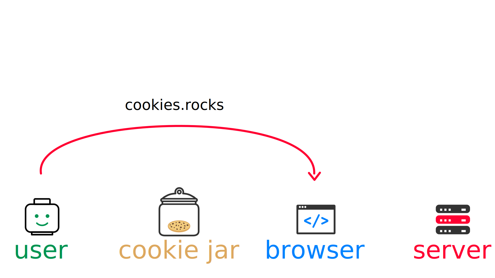

= #RetourAuxSources : Les Cookies HTTP
Hubert Sablonnière
:author-twitter: @hsablonniere
:author-avatar: img/hsablonniere-profil-2017.jpg
:author-company: Clever Cloud
:author-company-logo: img/clever-cloud-logo.svg
:hashtags: #CookiesRocks
:event: BreizhCamp
:date: 30 mars 2018

[#poster-intro, slide=poster]
Intro

[WARNING#warning-old-stuffs, caption=Avertissement]
Cette présentation n'aborde aucune technologie à la mode.
Le sujet se concentre sur un vieux truc inventé dans les années 90 (que vous connaissez peut-être déjà).
[.question]#Acceptez-vous de poursuivre la présentation ?#
Si vous voulez savoir comment déployer dans la blockchain des microservices Kotlin avec Kubernetes, il est encore temps de changer de salle...

[#london-pre, slide=location]
&nbsp;

[#london, slide=location]
Il y a quelques mois...
221b Baker Street
Londres
// Marylebone, Londres
// NW1 6XE

// image::img/screenshots/patents-google-com-patent-us5774670a-en.jpg[]

[#sherlock-intro, slide=sherlock]
I'm almost there...

[#sherlock-intro, slide=sherlock]
What's up Sherlock?

[#sherlock-intro-02.sherlock, slide=sherlock]
I'm confused by bloody developers!

[#sherlock-intro-03.sherlock, slide=sherlock]
Such fashion victims!

[#sherlock-intro-04, slide=sherlock]
It seems logical, isn't&nbsp;it?

[#sherlock-intro-03.sherlock, slide=sherlock]
They're missing the great investigation!

[#sherlock-intro-04, slide=sherlock]
Which one?

[#sherlock-intro-04.sherlock, slide=sherlock]
HTTP cookies of&nbsp;course!

[#sherlock-intro-04.sherlock, slide=sherlock]
I asked Hubert to investigate...

[#sherlock-intro-04, slide=sherlock]
The fucking froggy?

[#sherlock-intro-04.sherlock, slide=sherlock]
Yes but he's a&nbsp;redhead.

[#sherlock-intro-04.sherlock, slide=sherlock]
Facts, facts, facts!

[#sherlock-intro-04, slide=sherlock]
Interesting...

[#poster-welcome, slide=poster]
Bonjour à tous

.Clever Cloud
[#clever-cloud.logo]
image::img/cc-rocket-man.png[]

[source#public-suffix-list, slide=code]
----
if (true) {
  toi.passerAuStand('Clever Cloud');
}
----

[#demo-simple-cookie, slide=blank]
Enchaînement vers cookies

[#back-to-1994.contain]
image::img/2018-1994.svg[]

// http://facesofopensource.com/lou-montulli/
// http://www.peteradamsphoto.com/lou-montulli-2/
[#lou-montulli.big.top]
image::img/loumontulli.jpg[author="Peter Adams"]

.Netscape
[#netscape.logo]
image::img/netscape_4-6.svg[]

[#fishcam, slide=text]
fishcam : des poissons en live depuis 1994

[#lynx, slide=text]
Lynx : navigateur mode texte

[#lynx-screenshot.top]
image::img/screenshots/en-wikipedia-org-wiki-lynx-web-browser.jpg[]

[#blink-tag, slide=text]
[.blink]`<blink>` : la meilleure balise de tous les temps !

[#shake-tag, slide=text]
[.shake]`<shake>` : si on m'avait demandé mon avis...

[#animated-gifs, slide=text]
gifs animés : parceque Java c'est trop long à charger

[#animated-gifs-example.contain]
video::videos/no.mp4[]

[#lou-and-cookies.contain.light]
image::img/loumontulli.jpg[author="Peter Adams"]

[#section-dev]
== Point de vue n°1 : celui/celle qui veut sécuriser son site Web

[#question-what-are-cookies, slide=question]
C'est quoi un cookie HTTP ?

// Diagramme séquence (simple) avec juste des bulles de discussion

[#cookies-flow-01.contain]
image::img/cookies-flow-01.svg[]

[#cookies-flow-02.contain]
image::img/cookies-flow-02.svg[]

[#cookies-flow-03.contain]
image::img/cookies-flow-03.svg[]

[#cookies-flow-04.contain]
image::img/cookies-flow-04.svg[]

[#cookies-flow-05.contain]
image::img/cookies-flow-05.svg[]

[#cookies-flow-06.contain]
image::img/cookies-flow-06.svg[]

[#cookies-flow-07.contain]
image::img/cookies-flow-07.svg[]

[#cookies-flow-08.contain]

[#cookies-flow-09.contain]
image::img/cookies-flow-09.svg[]

[#cookies-flow-10.contain]
image::img/cookies-flow-10.svg[]

[#cookies-flow-11.contain]
image::img/cookies-flow-11.svg[]

[#cookies-flow-12.contain]

[#demo-simple-cookie, slide=blank]
Démo d'un cookie simple dans le browser

[#rfcs-01.contain]
image::img/rfcs-01.svg[]

[#rfcs-02.contain]
image::img/rfcs-02.svg[]

[#rfcs-03.contain]
image::img/rfcs-03.svg[]

// [#rfcs-04.contain]
// image::img/rfcs-04.svg[]
//
// [#rfcs-05.contain]
// image::img/rfcs-05.svg[]

[#question-cookie-storage-duration, slide=question]
Combien de temps  est stocké un cookie ?

.Expirer à la fermeture de la session
[source#example-cookie-simple, cookies]
Set-Cookie: name=value

.Expirer à une date
[source#example-cookie-expires, cookies]
Set-Cookie: name=value;
            Expires=Wed, 20 Jan 2021 10:30:00 GMT

.Expirer dans 24h
[source#example-cookie-max-age, cookies]
Set-Cookie: name=value; Max-Age=86400

[#demo-persistent-cookie, slide=blank]
Démo de cookie persistent

[#question-what-are-cookies, slide=question]
Comment le serveur  supprime un cookie ?

.Supprimer un cookie
[source#example-cookie-expires-delete, cookies]
Set-Cookie: name=value;
            Expires=Thu, 01 Jan 1970 00:00:00 GMT

.Supprimer un cookie
[source#example-cookie-max-age-delete, cookies]
Set-Cookie: name=value; Max-Age=0

[#demo-delete-cookie, slide=blank]
Démo suppression de cookie

[#question-when-are-cookies-sent, slide=question]
Quand est-ce que  les cookies sont  envoyés automatiquement ?

[source#example-cookie-domain-unset, cookies]
Set-Cookie: name=value

[source#example-cookie-domain, cookies]
Set-Cookie: name=value; Domain=cookies.rocks

[source#example-cookie-subdomain, cookies]
Set-Cookie: name=value; Domain=blue.cookies.rocks

[source#example-cookie-subsubdomain, cookies]
Set-Cookie: name=value; Domain=big.blue.cookies.rocks

[#demo-domain-cookie, slide=blank]
Démos de cookies avec l'attribut Domain

// [#recap-domain-attribute, slide=table]
// --
// |===
// |                       |c.r |blue.c.r |green.c.r |big.blue.c.r
//
// // |sans domaine           |OUI |         |          |
// |domaine c.r            |OUI |OUI      |OUI       |OUI
// |sous-domaine blue.c.r  |    |OUI      |          |OUI
// |sous-domaine green.c.r |    |         |OUI       |
// |===
// --

[#question-a-cookie-on-dot-com, slide=question]
Un cookie pour `.com` ?

[#no-dot-com-cookie.contain]
video::videos/no.mp4#t=4[]

[#screenshot-bugzilla-issue-dot-co-dot-uk.top]

[#screenshot-bugzill-331510.top]

[#screenshot-bugzilla-342314.top]

// [#screenshot-bugzilla-mozilla-org-show-bug-cgi-id-9422.top]
// image::img/screenshots/bugzilla-mozilla-org-show-bug-cgi-id-9422.jpg[]

[#screenshot-wiki-mozilla-org-public-suffix-list.top]

.https://publicsuffix.org
[#screenshot-publicsuffix-org.top]
image::img/screenshots/publicsuffix-org.jpg[]

[#rfcs-04-again.contain]
image::img/rfcs-04.svg[]

.RFC 6265
[#rfc-6265-public-suffix.top]

[#screenshot-dxr-mozilla-org-mozilla-central-source-netwerk-dns-effective-tld-names-dat.top]
image::img/screenshots/dxr-mozilla-org-mozilla-central-source-netwerk-dns-effective-tld-names-dat.jpg[]

[#screenshot-chromium-googlesource-com-chromium-src-net-master-base-registry-controlled-domains-effective-tld-names-dat.top]

[#screenshot-github-com-webkit-webkit-blob-master-source-webcore-platform-soup-publicsuffixsoup-cpp.top]
image::img/screenshots/github-com-webkit-webkit-blob-master-source-webcore-platform-soup-publicsuffixsoup-cpp.jpg[]

[#screenshot-github-com-gnome-libsoup-blob-master-data-effective-tld-names-dat.top]
image::img/screenshots/github-com-gnome-libsoup-blob-master-data-effective-tld-names-dat.jpg[]

.Public Suffix List (extrait)
[source#public-suffix-list, slide=code]
----
// GitHub, Inc.
// Submitted by Patrick Toomey <security@github.com>
github.io
githubusercontent.com

// GitLab, Inc.
// Submitted by Alex Hanselka <alex@gitlab.com>
gitlab.io
----

[#question-a-cookie-on-dot-com, slide=question]
Un cookie pour `.localhost` ?

[#no-dot-com-cookie.contain]
video::videos/no.mp4#t=7[]

[#no-dot-com-cookie-pause, slide=blank]
Pause gif

[source#example-cookie-path, cookies]
Set-Cookie: name=value; Path=/api

[#demo-domain-cookie, slide=blank]
Démos de cookies avec l'attribut path

[source#example-cookie-secure, cookies]
Set-Cookie: name=value; Secure

[#demo-domain-cookie, slide=blank]
Démos de cookies avec l'attribut secure

[#strict-secure-draft.top]
image::img/screenshots/tools-ietf-org-html-draft-ietf-httpbis-cookie-alone-01.jpg[]

.Header HSTS (attention !)
[source#public-suffix-list, slide=code]
----
Strict-Transport-Security: max-age=86400;
                           includeSubDomains
----

[#question-cookie-port-verification, slide=question]
Y a-t-il une  vérification sur le port ?

[#gif-no-port-cookie.contain]
video::videos/no.mp4#t=13[]

[#animated-gifs, slide=text]
SOP : Same Origin Policy

[.contain]
image::img/origin.svg[]

[#draft-strict-cookies.top]

[#animated-gifs, slide=text]
AJAX : Asynchronous JavaScript & XML

[source#public-suffix-list, slide=code]
----
const xhr = new XMLHttpRequest();
xhr.open('GET', '/url', true);
xhr.responseType = 'json';

xhr.withCredentials = true;

xhr.send();
----

// CORS
[source#public-suffix-list, slide=code]
Access-Control-Allow-Credentials: true

[#animated-gifs, slide=text]
fetch : La nouvelle XHR

// CORS
[source#public-suffix-list, slide=code]
fetch('/url', { credentials: 'omit' })
fetch('/url', { credentials: 'same-origin' })
fetch('/url', { credentials: 'include' })

// withCredentials pour le cross site

[#screenshot-caniuse-fetch.contain]
image::img/screenshots/caniuse-com-feat-fetch.jpg[]

// credentials: 'include'

[#cookies-flow-08-bis.contain]

[#cookies-flow-09-bis.contain]
image::img/cookies-flow-09.svg[]

[#cookies-flow-10-bis.contain]
image::img/cookies-flow-10.svg[]

[#cookies-flow-11-bis.contain]
image::img/cookies-flow-11.svg[]

[#question-what-is-csrf, slide=question]
C'est quoi  une attaque CSRF/XSRF ?

[#demo-csrf, slide=blank]
Démos CSRF

[#owasp-csrf.top]
image::img/screenshots/www-owasp-org-index-php-cross-site-request-forgery-csrf.jpg[]

[#rfcs-05-again.contain]

[source#example-cookie-samesite-lax, cookies]
Set-Cookie: name=value; SameSite=Lax

[source#example-cookie-samesite-strict, cookies]
Set-Cookie: name=value; SameSite=Strict

[#demo-samesite-cookie, slide=blank]
Démos samesite

// [#screenshot-caniuse-samesite-cookies.contain]
// image::img/screenshots/caniuse-com-feat-same-site-cookie-attribute.jpg[]

[#question-who-can-read-cookies, slide=question]
Qui peut lire quels cookies ?

[#document-cookie, slide=text]
`document.cookie` : l'API navigateur la plus étrange du monde

[#demo-document-cookie, slide=blank]
Démo document.cookie

[#question-xss-attack, slide=question]
C'est quoi  une attaque XSS ?

[#owasp-xss.top]

[#csp.top]
image::img/screenshots/developers-google-com-web-fundamentals-security-csp.jpg[]

[source#example-cookie-http-only, cookies]
Set-Cookie: name=value; HttpOnly

[#demo-httponly-cookie, slide=blank]
Démo http only

[#rfcs-05-again.contain]

[source#example-cookie-prefix-s, cookies]
Set-Cookie: __Secure-name=value; Secure

[source#example-cookie-prefix-h, cookies]
Set-Cookie: __Host-name=value; Secure; Path=/

.Récap. des attributs
[source#example-recap-attributes, cookies]
Set-Cookie: name=value;
            Expires=Tue, 03 Nov 2020 00:00:00 GMT;
            Max-Age=86400;
            Domain=one.cookies.rocks;
            Path=/api;
            Secure;
            HttpOnly;
            SameSite=Lax;
            SameSite=Strict

[#question-cookie-alternatives, slide=question]
Quelles alternatives  pour un stockage local ?

[#window-name, slide=text]
`window.name` : la vieille technique cross-site

[#demo-window-name, slide=blank]
Démo window.name

[#web-storage, slide=text]
Web Storage : `localStorage` et `sessionStorage`

[#demo-web-storage, slide=blank]
Démo Web Storage

[#question-cnil-dev, slide=question]
Que dit la CNIL ?

[#cnil-conformity]
image::img/screenshots/www-cnil-fr-fr-cookies-comment-mettre-mon-site-web-en-conformite.jpg[]

[#cnil-the-law]
image::img/screenshots/www-cnil-fr-fr-cookies-traceurs-que-dit-la-loi.jpg[]

[#section-tracker]
== Point de vue n°2 : celui/celle qui veut "tracer" ses visiteurs

// rappel conditions du CSRF

[#demo-third-party-cookie, slide=blank]
Démo tracking cookie tiers avec referer

[#question-what-is-referer, slide=question]
C'est quoi le referer ?

[#w3c-referer-policy.contain]
image::img/screenshots/caniuse-com-search-referer.jpg[]

[#w3c-referer-policy.top]
image::img/screenshots/www-w3-org-tr-referrer-policy.jpg[]

[#question-what-is-a-super-cookie, slide=question]
C'est quoi un supercookie ?

[#tracking-without-javascript, slide=text]
Traçage sans JavaScript : ETag, Date, HSTS Pinning, 301 Redirect...
// redirect ?

[#demo-etag-cookie, slide=blank]
Démo tracking etag avec referer

[#tracking-with-javascript, slide=text]
Traçage avec JavaScript : Cache, Web Storage, IndexedDB, window.name, Canvas...

[#tracking-with-javascript-01, slide=text]
Traçage avec JavaScript : (CSS :visited)...

[#tracking-with-javascript-02, slide=text]
Traçage JavaScript : (Flash, Silverlight)...

[#evercookie.top]
image::img/screenshots/github-com-samyk-evercookie.jpg[]

[#evercookie-list.top]
image::img/screenshots/github-com-samyk-evercookie-browser-storage-mechanisms.jpg[]

[#section-web-citizen]
== Point de vue n°3 : celui/celle qui est soucieux de sa vie privée

[#question, slide=question]
Comment régler  mon navigateur ?

[#browser-cookie-settings, slide=text]
Les cookies tiers

[#demo-browser-cookie-settings, slide=blank]
Démo du réglage des cookies tiers

[#browser-referer-settings, slide=text]
L'en-tête `referer`

[#demo-referer-settings, slide=blank]
Démo du réglage des referers

[#question-cookies-sqlite, slide=question]
Ils sont où les cookies ?

[#demo-cookies-sqlite, slide=blank]
Démo du fichier contenant les cookies

[#question-browser-extensions, slide=question]
Faut-il installer des  extensions navigateur  en plus ?

[#screenshot-https-everywhere.top]
image::img/screenshots/www-eff-org-fr-https-everywhere.jpg[]

uBlock

[#screenshot-adblockplus.top]
image::img/screenshots/adblockplus-org-fr.jpg[]

[#screenshot-ghostery.top]
image::img/screenshots/www-ghostery-com-fr.jpg[]

[#screenshot-facebook-container.top]
image::img/screenshots/addons-mozilla-org-en-us-firefox-addon-facebook-container.jpg[]

[#screenshot-disconnect.top]
image::img/screenshots/disconnect-me.jpg[]

[#screenshot-privacy-badger.top]
image::img/screenshots/www-eff-org-fr-privacybadger.jpg[]

[#screenshot-noscript.top]
image::img/screenshots/noscript-net.jpg[]

[#screenshot-panopticlick.top]
image::img/screenshots/panopticlick-eff-org-about.jpg[]

[#tor.top]
image::img/screenshots/www-torproject-org-projects-torbrowser-html-en.jpg[]

[#question-private-browsing, slide=question]
Que fait la navigation privée  dans tout ça ?

[#question-free-wifi, slide=question]
WiFi gratuits ?

// [#question-cnil-citizen, slide=question]
// La CNIL est mon amie

[#back-to-2018.contain]
image::img/1994-2018.svg[]

// https://web.archive.org/web/20130912000824/http://www.montulli-blog.com:80/2013/05/why-blocking-3rd-party-cookies-could-be.html
// Lou
// The answer is pretty simple:
//
// [#quote]
// The evil you know is better than the one you don't.
// This is probably a race we can't win.

[#sherlock-outro, slide=blank]
Histoire d'outro avec Sherlock

[#sherlock-intro-02.sherlock, slide=sherlock]
Wow&nbsp;lots&nbsp;of facts&nbsp;here!

[#sherlock-intro-02, slide=sherlock]
Indeed

[#sherlock-intro-02.sherlock, slide=sherlock]
Know when it smells...

[#sherlock-intro-02.sherlock, slide=sherlock]
Spread knowledge...

[#sherlock-intro-02.sherlock, slide=sherlock]
Debate&nbsp;the&nbsp;future of&nbsp;the Web!

.Merci bcp !
[#poster-thx, slide=poster]
Outro

[#question-questions, slide=question]
Des questions ?
