= #RetourAuxSources : Les Cookies HTTP
Hubert Sablonnière
:author-twitter: @hsablonniere
:author-avatar: img/hsablonniere-profil-2017.jpg
:author-company: Clever Cloud
:author-company-logo: img/clever-cloud-logo.svg
:hashtags: #CookiesRocks
:event: DevFest Toulouse
:date: 8 novembre 2018
:city: Toulouse

[slide=poster]
Intro

[.time]#00:00:00#

[WARNING, caption=Avertissement]
Cette présentation n'aborde aucune technologie à la mode.
Le sujet se concentre sur un vieux truc inventé dans les années 90 (que vous connaissez peut-être déjà).
[.question]#Acceptez-vous de poursuivre la présentation ?#
Si vous voulez savoir comment déployer dans la blockchain des microservices Kotlin avec Kubernetes, il est encore temps de changer de salle...

[.four]#musique#

[slide=location]
Il y a quelques mois...
221b Baker Street
Londres

[quote, Watson]
I'm almost there...

#Accent anglais (grosse voix)#
J'arrive Sherlock, j'arrive...

[quote, Watson]
What's up Sherlock?

Que se passe t-il encore ?

[quote, Watson]
What are we doing in Chocolatine City?

Que fait-on dans cette magnifique ville de {city} ?

[quote, Sherlock]
I'm disappointed by bloody developers!

#Accent anglais (voix condescendante)#
Et bien mon cher Watson,
je suis troublé par les développeurs et les développeuses.
J'ai regardé le programme de plusieurs conférences...

[quote, Sherlock]
Such fashion victims!

...et j'ai l'impression qu'ils sont uniquement intéressés par les dernières technologies à la mode.

[quote, Watson]
It seems logical, isn't it?

Je ne vois pas où est le problème ?
Ça semble logique de vouloir s'informer sur les nouveautés liées à son propre métier.

[quote, Sherlock]
But they're missing  the great investigation!

Yes but, plus personne ne s'intéresse aux vieux machins.
Tout le monde passe à côté de l'enquête la plus importante de tous les temps.

[quote, Watson]
Which one?

Hum ?
Laquelle ?

[quote, Sherlock]
HTTP cookies of course!

Les cookies HTTP bien sûr.

[quote, Sherlock]
You know nothing John.

Vous êtes à côté de la plaque John,
Tout le monde les utilise mais plus personne ne connaît vraiment leur origine ni même comment ils fonctionnent.
Ça implique chez les devs pas mal de bêtises sur les projets Web
et chez moldus, _"les non-informaticiens"_, je constate une profonde méconnaissance en ce qui concerne le tracking et le respect de la vie privée.

[quote, Sherlock]
I asked Hubert to investigate...

J'ai demandé à Hubert Sablonnière de mener l'enquête.

[quote, Watson]
The fucking froggy?

#Air déçu et inquiet#
Le français ?

[quote, Sherlock]
Yes but he's a redhead.

Oui mais bon...
#hésitations#
comment dire...
il ressemble un peu à un anglais, n'est-ce pas ?

[quote, Sherlock]
#BackToBasics

Je lui ai demandé de faire un "retour aux sources".

[quote, Sherlock]
Facts, facts, facts!

et surtout de nous remonter les _facts_, rien que les _facts_.
Ainsi, chacun - en fonction de son propre contexte personnel et professionnel - pourra détecter certains problèmes et prendre les bonnes décisions...

[quote, Watson]
Interesting...

Hum, je suis intrigué...

[slide=poster]
Bonjour à tous

[.time]#00:02:00#
#mode normal (et énergique)#
Bonjour à *toutes* et tous !
J'm'appelle Hubert Sablonnière,
J'suis développeur Web chez #Clever Cloud#.

.Clever Cloud
image::img/cc-rocket-man.png[role=logo]

[.question]#Qui connait Clever Cloud ?#
Chez Clever, on fait de l'**IT automation**.
// Quand je dis IT automation, ça veut dire que globalement on fournit un outil et que ce soit sur notre cloud ou "on-premise", les développeurs n'ont plus qu'à envoyer leur code et nous on s'occupe du reste :
On fournit un outil sur notre cloud _ou "on-premise"_ qui permet aux devs de se concentrer sur l'essentiel :
*écrire du code et le pousser*.
Pendant ce temps là, nous on se concentre sur le reste :
*Le builder, le déployer, le "monitorer", relancer automatiquement ce qui est planté*
*et bien évidemment maintenir et mettre jour toutes les couches sur lesquelles ce code tourne.*

// [source, js, slide=code]
// if (false === connaitCleverCloud) {
//   toi.passerAuStand('Clever Cloud');
// }
//
// Si vous ne nous connaissez pas, passez voir notre stand, on vous expliquera tout ça...
//
// [source, js, slide=code]
// if (true === connaitCleverCloud) {
//   toi.passerAuStand('Clever Cloud');
// }
//
// Si vous nous connaissez déjà, passez voir notre stand, on pourra discuter de la plateforme et de ce que vous en faite.
// Si vous... #PAUSE# Enfin bref...
//
// [source, js, slide=code]
// if (true) {
//   toi.passerAuStand('Clever Cloud');
// }
//
// ...passez voir notre stand ;-)

[slide=blank]
Enchaînement vers cookies

[.time]#00:03:00#
Aujourd'hui, j'ai envie de vous parler de mon enquête sur les cookies HTTP.

image::img/2018-unknown.svg[]

Alors, j'ai commencé par retourner à la source des cookies.

image::img/2018-1994.svg[]

#Narrateur#
(Nous sommes en 1994)
et je me suis intéressé à...

// http://facesofopensource.com/lou-montulli/
// http://www.peteradamsphoto.com/lou-montulli-2/
image::img/loumontulli.jpg[author="Peter Adams", role="big top"]

...ce monsieur!
#Mains en l'air qui prient au ciel#

image::img/loumontulli.jpg[title="Lou Montulli" author="Peter Adams", role="big top"]

*Lou Montulli*
Quand on s'intéresse à l'histoire du Web,
on parle souvent de Tim Berners-Lee ou de Robert Cailleau.

[slide=text]
#ILoveLou : mot-dièse à utiliser sans modération

Aujourd'hui, je voudrai rendre hommage à Lou et souligner l'impact qu'il a eu sur pas mal de technologies du Web qu'on utilise encore aujourd'hui.
C'est parti pour les anecdotes !

.Netscape
image::img/netscape_4-6.svg[role=logo]

En 1994, Lou travaille chez Netscape et avec ses collègues...

[slide=text]
fishcam : des poissons en live depuis 1994

...il met en place la 2ème webcam de l'histoire.
Un petit _easter-egg_ accessible via *Ctrl+Alt+F* sur Netscape et qui aujourd'hui...

[slide=blank, data-viewport=3]
Démo fishcam

...est toujours dispo sur *fishcam.com* !
#Démo fishcam#
L'aquarium est en Californie et là on voit bien une photo qui date d'il y a qq secondes.
#Voix d'enfant#
Coucou les petits poissons !
Bon, ça DL 30 kilo toutes les 2 secondes soit 40 megs d'ici là fin du talk alors on va fermer la page quand même.
-> 640 by 480 pixel image and took nearly 20 seconds
-> Updated every minute

[slide=text]
Lynx : navigateur Web en mode texte

Lou est aussi le co-créateur de Lynx, un navigateur Web en mode texte

[slide=blank, data-viewport=4]
Démo lynx

#Démo lynx#
Pour ceux qui connaissent pas, Lynx, c'est assez rudimentaire mais c'est *uuuultra*-rapide !
Je peux aller sur le site du CFP de Devoxx,
chercher "cookies" et trouver des infos sur cette présentation.
Je m'en sers pas tous les jours, mais à chaque fois je trouve que ça remet en perspective l'importance du contenu et de l'accessibilité sur un site Web.

[slide=blank]
Intro <blink>

A propos de Lynx, tiens.
Une soirée d'été 1994, après le boulot, Lou et ses collègues vont boire des verres dans un bar.
Ils discutent du futur du Web, des possibles extensions d'HTML et dans cette discussion, Lou mentionne qu'il était un peu triste car à cause de ses limitations graphiques, Lynx ne pourraient probablement pas supporter toutes ces nouveautés.
La seule chose que Lynx pouvait faire, c'était à la rigueur de faire clignoter du texte.

[slide=blank]
Intro <blink>

#Faux rire#
Ah ah ah, qu'est ce qu'ils ont bien rigolé sur le fait que cette idée était complètement absurde.
La soirée continue, Lou rencontre celle qui deviendra sa femme et le lendemain matin en arrivant au boulot,
il découvre que son collègue _"Jean-Michel 1er degré"_ est repassé par le bureau après la soirée...

[slide=text]
[.blink]`<blink>` : la meilleure balise de tous les temps !

...et a implémenté dans la nuit la meilleure balise de tout les temps.
Tout a donc commencé avec un _easter-egg_ non documenté dans Netscape.
La suite de l'histoire, vous la connaissez...
Et encore...

[slide=text]
[.shake]`<shake>` : si on m'avait demandé mon avis...

...si j'avais participé à cette soirée, ça aurait pu être bien pire !

[slide=blank]
Lancement gif

On se moque mais, cette balise on l'a tous utilisé,
et à l'époque, tout était bon à prendre pour attirer l'attention des visiteurs sur les bannières de pub.
Quand le plugin Java est arrivé dans Netscape,
beaucoup s'en sont emparé pour animer du texte et le faire défiler.
Le problème, c'est que le plugin mettait une bonne trentaine de secondes à se lancer.

video::videos/no.mp4[]

Et ça, ça frustrait beaucoup notre ami Lou.
Il voulait remplacer les pubs en Java par autre chose.
Du coup pendant un mois, il a tanné Scott Furman, celui qui bossait sur le code d'imaging de Netscape,

[slide=text]
gifs animés : parceque Java c'est trop long à charger

pour ajouter une extension au format gif et ainsi boucler plusieurs fois sur l'animation des frames présentes dans le fichier.
C'est exactement pour ça qu'aujourd'hui encore, si vous ouvrez n'importe quel gif animé avec le bon éditeur,
vous verrez le "Netscape Application Block" qui permet de préciser combien de fois l'animation doit recommencer.
Avec 0 pour l'infini.

image::img/loumontulli.jpg[author="Peter Adams", role="light unzoom"]

[.one]#unzoom#
Si je vous parle autant de Lou c'est aussi est surtout,
parce que c'est l'inventeur des cookies HTTP.
À une époque où le Web était encore complètement sans état,
implémenter un site e-commerce avec un panier virtuel tout en étant capable de reconnaître un même client entre plusieurs chargement de pages...
#grimace# c'était pas la joie.
Et c'est bien dans ce but précis,
maintenir un visiteur connecté sur un site
que Lou a voulu ajouter un état côté client.
Dans mon enquête je me suis intéressé à plusieurs points de vues.
Celui que je veux vous présenter aujourd'hui,

== Point de vue : celui/celle qui utilise  des cookies  sur son site Web

[.time]#00:08:00#
c'est le point de vue de celui ou celle qui utilise des cookies sur son site Web.
[.question]#Il y des devs dans la salle ?#
Ça tombe bien !
Donc on va vraiment revenir aux bases,
en posant une série de questions et en y apportant des réponses.
Je vais peut-être expliquer des choses que vous savez déjà,
mais les rappels ça fait toujours du bien
et on va aussi parler de certaines nouveautés.

[slide=question]
C'est quoi un cookie HTTP ?

[.time]#00:08:30#
Première question : _C'est quoi un cookie HTTP ?_
Déjà on va arrêter de dire que les cookies sont des fichiers stockés sur un ordinateur.
C'est incomplet et daté car les cookies c'est + qu'une forme de stockage et ça fait bien longtemps qu'on ne stocke plus un cookie par fichier.
On va également arrêter de mélanger/confondre les cookies avec une session utilisateur stockée côté serveur.
Trop souvent, j'entends quelqu'un dire, "j'ai stocké cette info dans les cookies"
alors qu'en fait l'info est stockée en RAM, côté serveur, dans la session utilisateur.
Je dis NON !
Moi j'préfère présenter les cookies comme un protocole.
Un comportement sur lequel navigateurs et serveurs se sont mis d'accord pour maintenir un état côté client.
Petit schéma.

image::img/cookies-flow-01.svg[]

Un utilisateur veut se rendre sur le site "cookies.rocks".

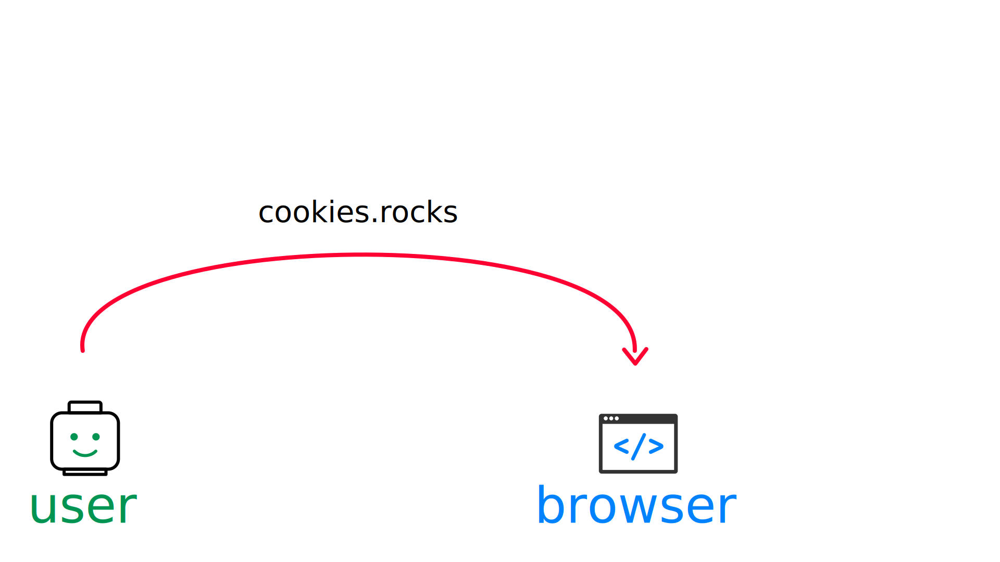

Il tape l'adresse dans son navigateur.

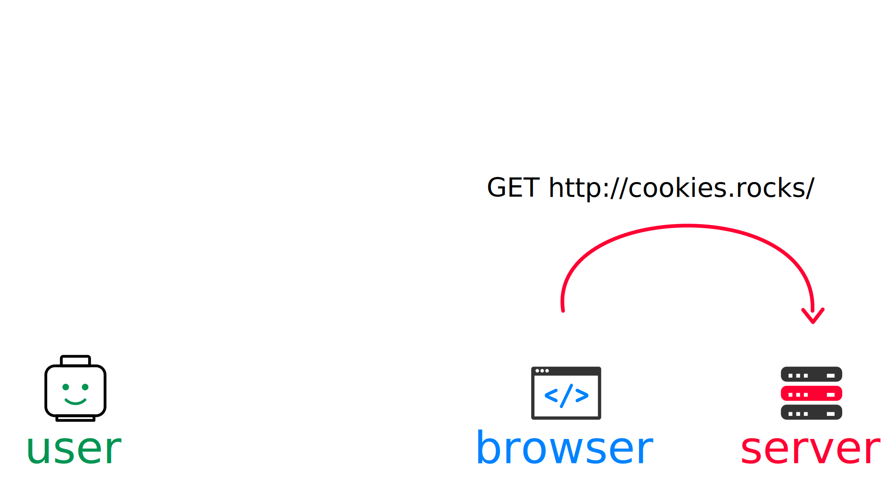

Son navigateur fait une requête HTTP :
*GET* vers *http://cookies.rocks/*

image::img/cookies-flow-04.svg[]

Le serveur répond :
*200 OK* avec la page HTML du site demandé.

image::img/cookies-flow-04b.svg[]

Mais surtout, le serveur utilise l'en-tête *`Set-Cookie`* pour demander au navigateur de stocker de l'information,
une clé et une valeur.

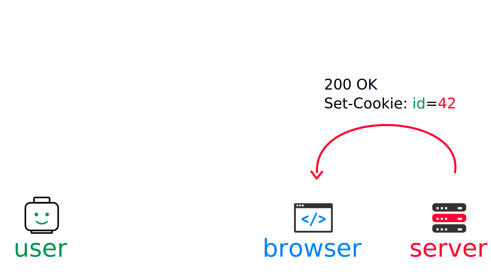

Et c'est vrai... que... le plus souvent, ce couple clé/valeur, permet de stocker un identifiant unique.

image::img/cookies-flow-04d.svg[]

Après ça peut aussi être tout simplement la langue choisie par l'utilisateur, un thème personnalisé...

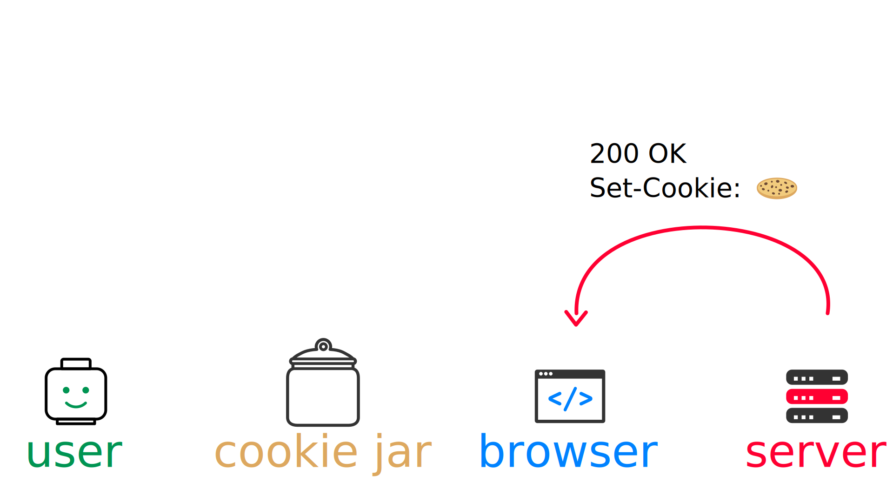

Côté navigateur, on a un espace de stockage, la jarre à cookies.
Quand le navigateur reçoit un cookie.

image::img/cookies-flow-06.svg[]

Il le stocke dans sa jarre.

image::img/cookies-flow-07.svg[]

Du coup, un peu plus tard,

image::img/cookies-flow-08.svg[]

quand l'utilisateur retourne sur le même site,

image::img/cookies-flow-09.svg[]

le navigateur regarde dans sa jarre si des cookies ont été déposés pour ce site,

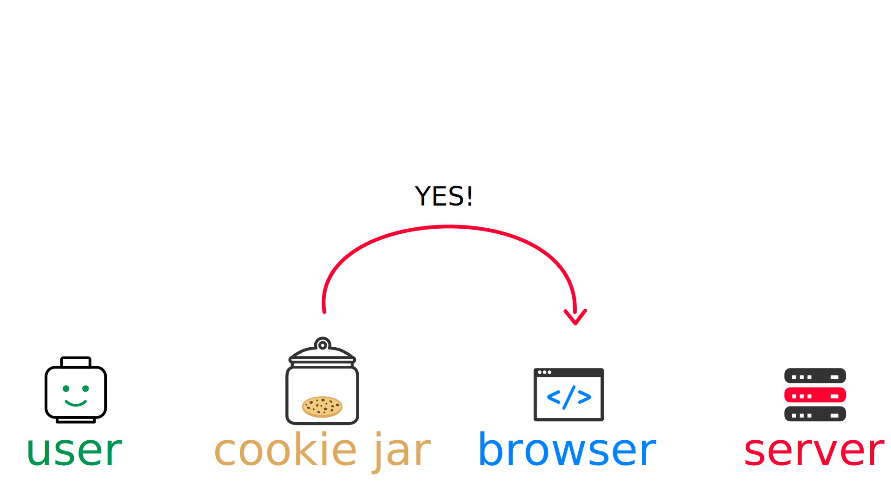

Et quand c'est le cas,

image::img/cookies-flow-11.svg[]

le navigateur fait sa requête HTTP comme avant :
*GET* vers *http://cookies.rocks/*

image::img/cookies-flow-11b.svg[]

et il renvoie l'information stockée avec l'en-tête *Cookie*

image::img/cookies-flow-11c.svg[]

Ici, on continue l'exemple où le cookie contient un identifiant.
Avec cette information,

image::img/cookies-flow-12.svg[]

Le serveur peut envoyer sa réponse HTTP :
*200 OK* avec la page HTML du site demandé.
Et surtout,

image::img/cookies-flow-12b.svg[]

Il peut contextualiser sa réponse.

[slide=blank]
Les cookies, c'est ça.

Les cookies, c'est ça.
#PAUSE#
Un protocole entre le serveur et le navigateur permettant le stockage d'un état côté client.

// [slide=blank, data-viewport=1]
// Démo d'un cookie simple dans le browser
//
// Démo d'un cookie simple dans le browser

image::img/rfcs-01.svg[]

Ce fonctionnement a été inventé et spécifié par Lou Montulli en 1994.

[.zoom-patent]
image::img/screenshots/cookie-patent.jpg[url="https://patents.google.com/patent/US5774670A/en"]

Si vous regardez le brevet, tout va bien :
* Lou
* Netscape
* Facebook ?

image::img/rfcs-02.svg[]

On a eu une vraie RFC en 1997,

image::img/rfcs-03.svg[]

et une autre en 2000,
mais globalement,
#PAUSE#
depuis 24 ans,
#PAUSE#
ça fonctionne toujours de la même manière.
#PAUSE#
Une fois que le navigateur a reçu un cookie.

[slide=question]
Combien de temps  est stocké un cookie ?

[.time]#00:11:40#
_Combien de temps est-ce qu'il le stocke ?_

.Expiration à la fermeture de la session
[source, cookies]
Set-Cookie: id=42

De base, quand le serveur envoie l'en-tête *Set-Cookie*,
c'est lui qui choisit combien de temps le cookie doit être stocké.
Ici l'identifiant 42 sera stocké dans le navigateur le temps de la session.
C'est à dire jusqu'à la fermeture du navigateur.
#PAUSE#
Pour demander un stockage persistant des cookies, le serveur a 2 moyens :

.Expiration à une date précise
[source, cookies]
Set-Cookie: id=42;
            Expires=Wed, 20 Jan 2021 10:30:00 GMT

Il peut définir une [.two]#date d'expiration# avec l'attribut [.one]#Expires#.

.Expiration après une certaine durée
[source, cookies]
Set-Cookie: id=42; Max-Age=86400

Ou il peut définir une [.two]#durée en secondes# avec l'attribut [.one]#Max-Age#.
-> Attribut ajouté par la première RFC officielle de 1997.
#PAUSE#
Un fois qu'un cookie est déposé par le serveur...

// [slide=blank]
// Démo de cookie persistent

[slide=question]
Comment demander  la suppression d'un cookie ?

[.time]#00:12:20#
..._comment peut-il demander la suppression d'un cookie_ avant son expiration.
Au départ, je me suis dit il doit bien y avoir un header
*Remove-Cookie* ou *Delete-Cookie*,
NON !
Pour demander la suppression d'un cookie...

.Demander la suppression d'un cookie
[source, cookies]
Set-Cookie: id=42;
            Expires=Thu, 01 Jan 1970 00:00:00 GMT

Le serveur peut utiliser l'attribut [.one]#Expires# avec [.two]#une date dans le passé#.
Généralement on utilise la date de reference epoch du 1er janvier 1970.

.Demander la suppression d'un cookie
[source, cookies]
Set-Cookie: id=42; Max-Age=0

Le serveur peut également utiliser l'attribut [.one]#Max-Age# avec une [.two]#durée égale à zéro#.

[slide=blank]
Pause, pb des cookies

Pour l'instant, les choses sont simples, pas de piège, pas de surprise.
Mais depuis tout à l'heure, je dis :
_"quand l'utilisateur retourne sur le site, le navigateur envoie automatiquement les cookies qui vont avec"_.
Mais qu'est-ce que ça veut dire "retourne sur le site" ?

[source, url]
http://mon.site.fr:8080/ma-page.html
https://your-blog.com/the-article.php

Comment le navigateur sait qu'entre une adresse A et une adresse B il s'agit oui ou non du même _"site"_ ?
Et en fait là,
on arrive sur le point qui pose le plus de problème avec les cookies,

// [slide=blank]
// Démo suppression de cookie

[slide=question]
Quand est-ce que  les cookies sont  envoyés automatiquement ?

[.time]#00:13:30#
le fait de savoir quand ils seront envoyés automatiquement par le navigateur (ou pas).

[source, url, suffix="TLD"]
http://blue.cookies.rocks:80/page.html

// [source, url, suffix="TLD"]
// http://big.blue.cookies.rocks:80/awesome-page.html

Si on regarde de plus près une URL,
on a 4 parties :
[.one]#le protocole#
[.three]#l'hôte#
[.two]#le port#
[.four]#le path#
[.three]#&# [.four]#sous domaine#
[.three]#&# [.two]#domaine#
// [.three]#&# [.one]#suffixe#

// [source, url]
// http://cookies.rocks/awesome-page.html
// http://blue.cookies.rocks/boring-page.html
//
// [source, url]
// https://blue.cookies.rocks/the-page.html
//
// [source, url]
// http://cookies.co.uk/the-page.html

.Attribut `Domain=`
[source, cookies]
Set-Cookie: id=42; Domain=cookies.rocks

.http://cookies.rocks/
[source, cookies]
🙈 Set-Cookie: no-domain=no
🙈 Set-Cookie: root-domain=root; Domain=cookies.rocks
🙈 Set-Cookie: blue-subdomain=blue; Domain=blue.cookies.rocks
🙈 Set-Cookie: green-subdomain=green; Domain=green.cookies.rocks

.http://cookies.rocks/
[source, cookies]
Set-Cookie: no-domain=no
🙈 Set-Cookie: root-domain=root; Domain=cookies.rocks
🙈 Set-Cookie: blue-subdomain=blue; Domain=blue.cookies.rocks
🙈 Set-Cookie: green-subdomain=green; Domain=green.cookies.rocks

.http://cookies.rocks/
[source, cookies]
Set-Cookie: no-domain=no
Set-Cookie: root-domain=root; Domain=cookies.rocks
🙈 Set-Cookie: blue-subdomain=blue; Domain=blue.cookies.rocks
🙈 Set-Cookie: green-subdomain=green; Domain=green.cookies.rocks

.http://cookies.rocks/
[source, cookies]
Set-Cookie: no-domain=no
Set-Cookie: root-domain=root; Domain=cookies.rocks
Set-Cookie: blue-subdomain=blue; Domain=blue.cookies.rocks
🙈 Set-Cookie: green-subdomain=green; Domain=green.cookies.rocks

.http://cookies.rocks/
[source, cookies]
Set-Cookie: no-domain=no
Set-Cookie: root-domain=root; Domain=cookies.rocks
Set-Cookie: blue-subdomain=blue; Domain=blue.cookies.rocks
Set-Cookie: green-subdomain=green; Domain=green.cookies.rocks

[slide=blank, data-viewport=1]
Démos de cookies avec l'attribut Domain

Vider les cookies
Afficher "show cookies" sur cookies.rocks
Afficher "show cookies" sur blue.cookies.rocks
Afficher "show cookies" sur green.cookies.rocks
Lancer "la page attr Domaine" sur cookies.rocks

[slide=text]
`Domain=` : augmente la portée du cookie  à tous les hôtes  qui se terminent par la valeur

Déposer des cookies pour des niveaux d'hôte plus généraux

.http://blue.cookies.rocks/
[source, url, setCookie="id=42"]
V http://blue.cookies.rocks/page.html
! http://big.blue.cookies.rocks/page.html
! http://green.cookies.rocks/page.html
! http://cookies.rocks/page.html
! http://foobar.rocks/page.html

.http://blue.cookies.rocks/
[source, url, setCookie="id=42; Domain=blue.cookies.rocks"]
V http://blue.cookies.rocks/page.html
V http://big.blue.cookies.rocks/page.html
! http://green.cookies.rocks/page.html
! http://cookies.rocks/page.html
! http://foobar.rocks/page.html

.http://blue.cookies.rocks/
[source, url, setCookie="id=42; Domain=cookies.rocks"]
V http://big.blue.cookies.rocks/page.html
V http://blue.cookies.rocks/page.html
V http://green.cookies.rocks/page.html
V http://cookies.rocks/page.html
! http://foobar.rocks/page.html

// .Quelles requêtes partiront avec les cookies ?
// [source, url, suffix="TLD"]
// http://cookies.rocks:80/page.html
// http://cookies.rocks:80/page.html
// http://blue.cookies.rocks:80/page.html
// http://example-foo.com:80/page.html
//
// .Réponse :
// [source, url, suffix="TLD"]
// http://cookies.rocks:80/page.html
// http://cookies.rocks:80/page.html
// # http://blue.cookies.rocks:80/page.html
// # http://example-foo.com:80/page.html
//
// .Déposé par http://cookies.rocks/page.html
// [source, cookies]
// Set-Cookie: id=42; Domain=cookies.rocks
//
// .Quelles requêtes partiront avec les cookies ?
// [source, url, suffix="TLD"]
// http://cookies.rocks:80/page.html
// http://cookies.rocks:80/page.html
// http://blue.cookies.rocks:80/page.html
// http://example-foo.com:80/page.html
//
// .Réponse :
// [source, url, suffix="TLD"]
// http://cookies.rocks:80/page.html
// http://cookies.rocks:80/page.html
// http://blue.cookies.rocks:80/page.html
// # http://example-foo.com:80/page.html
//
// [source, cookies]
// Set-Cookie: id=42; Domain=blue.cookies.rocks
//
// [source, cookies]
// Set-Cookie: id=42; Domain=big.blue.cookies.rocks

[slide=question]
Un cookie avec `Domain=rocks` ?

video::videos/no.mp4#t=4[]

[source, url, suffix="TLD"]
http://big.blue.cookies.rocks:80/page.html

[.one]#&# [.three]#TLD#

[source, url, suffix="TLD"]
http://big.blue.cookies.co.uk:80/page.html

[.one]#&# [.three]#TLD#

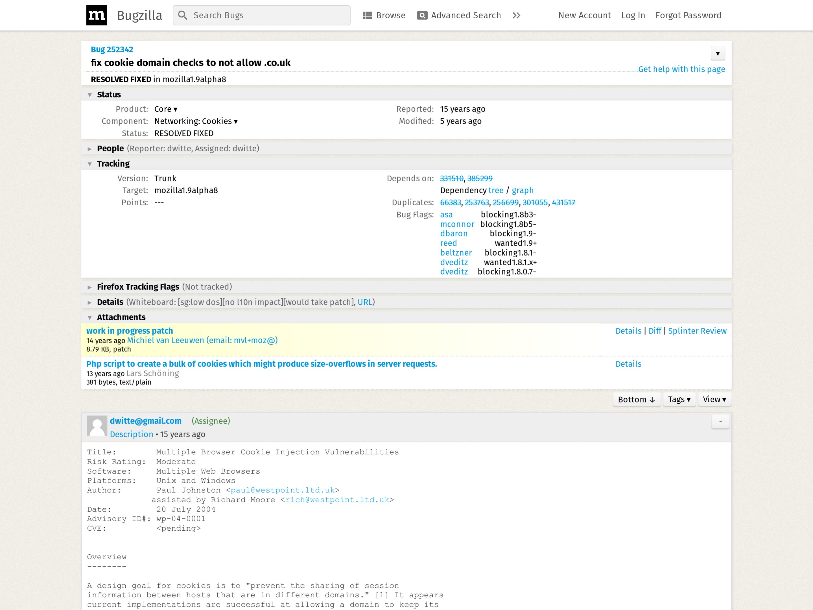

image::img/screenshots/mozilla-issue-331510.jpg[url="https://bugzilla.mozilla.org/show_bug.cgi?id=331510"]

image::img/screenshots/mozilla-issue-342314.jpg[url="https://bugzilla.mozilla.org/show_bug.cgi?id=342314"]

image::img/screenshots/mozilla-public-suffix-list.jpg[url="https://wiki.mozilla.org/Public_Suffix_List"]

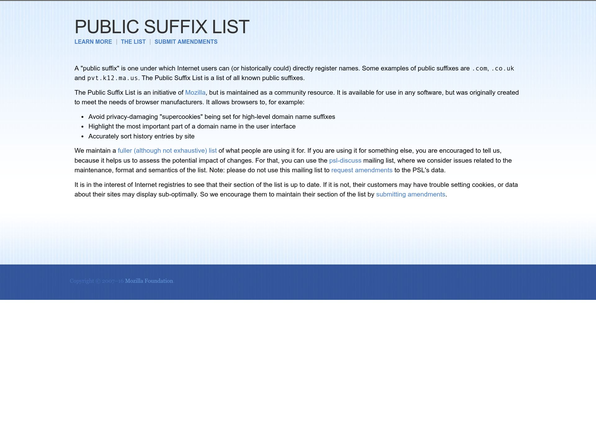

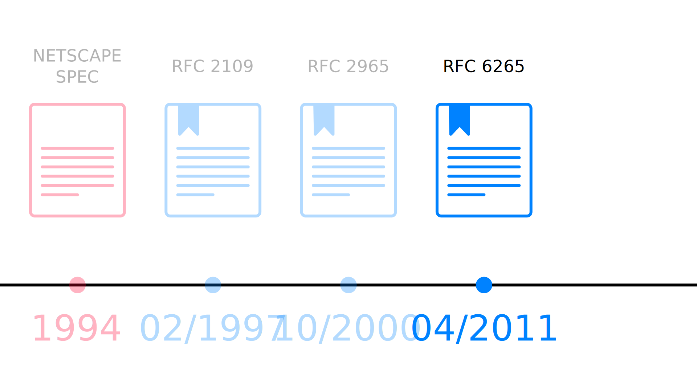

image::img/screenshots/rfc6265-page23.jpg[url="https://tools.ietf.org/html/rfc6265#page-23", width="1024"]

image::img/screenshots/mozilla-source-effective-tld-names.jpg[url="https://dxr.mozilla.org/mozilla-central/source/netwerk/dns/effective_tld_names.dat", width="1024"]

image::img/screenshots/chrome-source-effective-tld-names.jpg[url="https://chromium.googlesource.com/chromium/src/net/+/master/base/registry_controlled_domains/effective_tld_names.dat"]

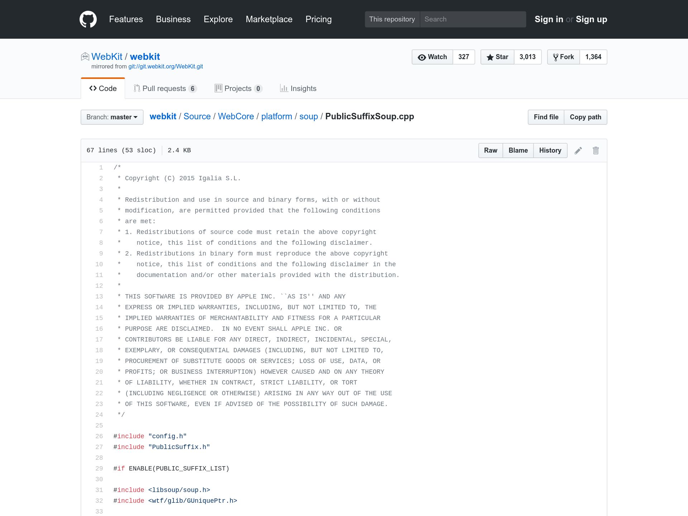

.Public Suffix List (extraits)
[source, c, slide=code]
----
// uk : https://en.wikipedia.org/wiki/.uk
// Submitted by registry [Michael.Daly@nominet.org.uk]
uk
co.uk
gov.uk
me.uk
police.uk

// jp : https://en.wikipedia.org/wiki/.jp
// http://jprs.co.jp/en/jpdomain.html
// Submitted by registry [info@jprs.jp]
jp
okinawa.jp
osaka.jp
tokyo.jp
----

.Public Suffix List (extrait)
[source, c, slide=code]
----
// GitHub, Inc.
// Submitted by Patrick Toomey [security@github.com]
github.io
githubusercontent.com

// Amazon Elastic Compute Cloud : https://aws.amazon.com/ec2/
// Submitted by Luke Wells [psl-maintainers@amazon.com]
*.compute.amazonaws.com

// Microsoft Corporation : http://microsoft.com
// Submitted by Justin Luk [juluk@microsoft.com]
azurecontainer.io
azurewebsites.net
azure-mobile.net
cloudapp.net
----

.Public Suffix List (extrait)
[source, c, slide=code]
----
// Clever Cloud : https://www.clever-cloud.com/
// Submitted by Quentin Adam [noc@clever-cloud.com]
cleverapps.io
----

[source, url]
http://cookies.rocks/
http://www.bbc.co.uk/news/
http://www.metro.tokyo.jp/
https://hsablonniere.gitlab.io/babbler/
https://foobar.cleverapps.io/

[.one]#&# [.three]#TLD#

[slide=question]
Un cookie avec `Domain=localhost` ?

video::videos/no.mp4#t=7[]

.Attribut `Path=`
[source, cookies]
Set-Cookie: id=42; Path=/api
Set-Cookie: id=42; Path=/admin

.http://cookies.rocks/
[source, url, setCookie="id=42"]
V http://cookies.rocks/some-page.html
V http://cookies.rocks/api/profile
V http://cookies.rocks/api-faq

.http://cookies.rocks/
[source, url, setCookie="id=42; Path=/api"]
! http://cookies.rocks/some-page.html
V http://cookies.rocks/api/profile
! http://cookies.rocks/api-faq

.http://cookies.rocks/
[source, url, setCookie="id=42; Path=/api-"]
! http://cookies.rocks/some-page.html
! http://cookies.rocks/api/profile
! http://cookies.rocks/api-faq

.http://cookies.rocks/
[source, url, setCookie="id=42; Path=/api-"]
! http://cookies.rocks/some-page.html
! http://cookies.rocks/api/profile
! http://cookies.rocks/api-faq
V http://cookies.rocks/api-/foobar

[slide=text]
`Path=` : restreint la portée du cookie  à tous les paths  qui commencent par la valeur*

// [slide=blank]
// Démos de cookies avec l'attribut path

.https://cookies.rocks/
[source, url, setCookie="id=42"]
V http://cookies.rocks/some-page.html
V https://cookies.rocks/some-page.html

Attribut secure

.Attribut `Secure`
[source, cookies]
Set-Cookie: id=42; Secure

.https://cookies.rocks/
[source, url, setCookie="id=42; Secure"]
! http://cookies.rocks/some-page.html
V https://cookies.rocks/some-page.html

[slide=text]
`Secure` : restreint la portée du cookie  aux requêtes sécurisées

.Header HSTS (attention !)
[source, bash, slide=code]
Strict-Transport-Security: max-age=86400;
                           includeSubDomains

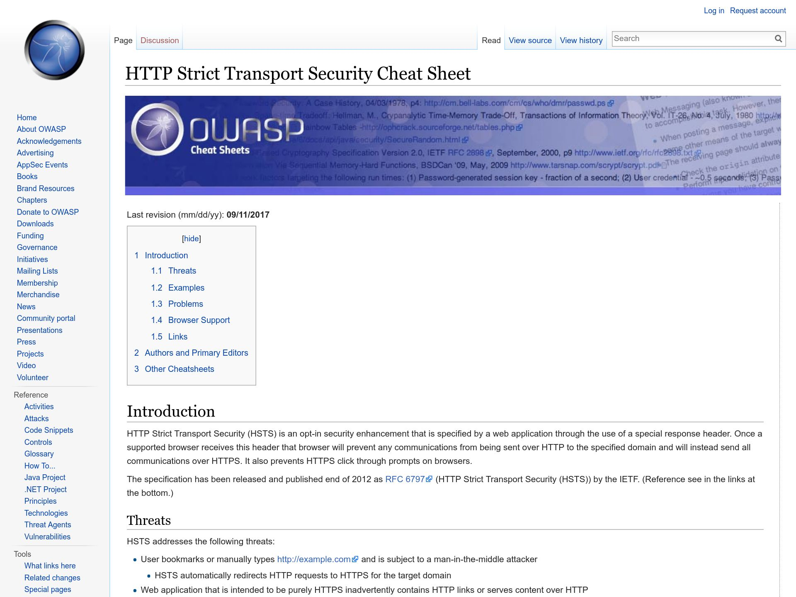

.http://cookies.rocks/ (non sécurisé)
[source, url, setCookie="id=42; Secure"]
! http://cookies.rocks/some-page.html
V https://cookies.rocks/some-page.html

image::img/screenshots/draft-ietf-httpbis-cookie-alone.jpg[url="https://tools.ietf.org/html/draft-ietf-httpbis-cookie-alone-01", width="1024"]

.Reçu par le serveur
[source, bash, slide=code]
Cookie: id=42

image::img/rfcs-05.svg[]

.Cookie prefix: `__Secure`
[source, cookies]
Set-Cookie: __Secure-id=42; Secure

[.three]#prefix#

.Cookie prefix: `__Host`
[source, cookies]
Set-Cookie: __Host-id=42; Secure; Path=/

[.three]#prefix#

[source, url]
http://blue.cookies.rocks:80/page.html

[slide=question]
Y a-t-il une  vérification sur le port ?

video::videos/no.mp4#t=13[]

[slide=text]
SOP : Same Origin Policy

[source, url]
http://blue.cookies.rocks:80/page.html

[.one]#&# [.two]#&# [.three]#Origin#
[.one]#&# [.three]#&# [.four]#Cookies#

image::img/screenshots/draft-west-origin-cookies.jpg[url="https://tools.ietf.org/html/draft-west-origin-cookies-01", width="1024"]

// [slide=text]
// AJAX : Asynchronous JavaScript & XML
//
// .Une XHR sur la même origine
// [source, js, slide=code]
// ----
// const xhr = new XMLHttpRequest();
// xhr.open('GET', '/url', true);
// xhr.responseType = 'json';
//
//
//
// xhr.send();
// ----
//
// .Une XHR sur une origine différente
// [source, js, slide=code]
// ----
// const xhr = new XMLHttpRequest();
// xhr.open('GET', '/url', true);
// xhr.responseType = 'json';
//
// xhr.withCredentials = true;
//
// xhr.send();
// ----
//
// .L'en-tête CORS qui va bien
// [source, bash, slide=code]
// Access-Control-Allow-Credentials: true
//
// [slide=text]
// fetch : L'AJAX mais en beaucoup mieux
//
// [source, js, slide=code]
// fetch('/url', { credentials: 'same-origin' })
// fetch('/url', { credentials: 'omit' })
// fetch('/url', { credentials: 'include' })
//
// image::img/screenshots/caniuse-fetch.jpg[url="https://caniuse.com/#feat=fetch"]

image::img/cookies-csrf-01.svg[]

Explications CSRF...

image::img/cookies-csrf-02.svg[]

image::img/cookies-csrf-03.svg[]

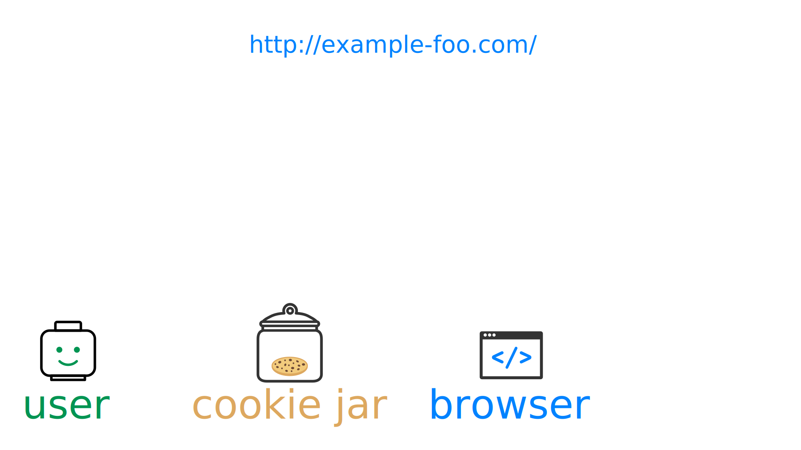

image::img/cookies-csrf-05.svg[]

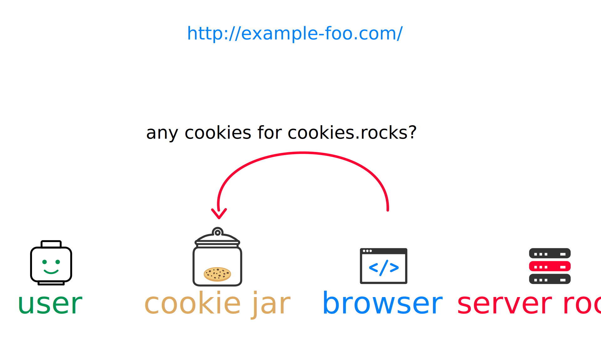

image::img/cookies-csrf-07.svg[]

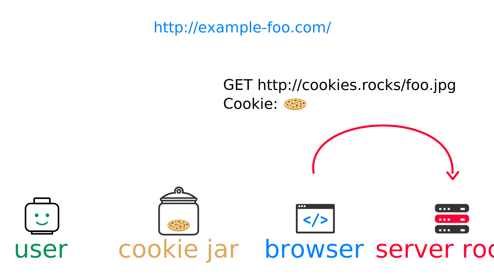

image::img/cookies-csrf-09.svg[]

[slide=question]
C'est quoi  une attaque CSRF/XSRF ?

[slide=blank, data-viewport=1]
Démos CSRF

#Démo CSRF#
Set profile sur cookies.rocks
Aller sur example-foo et cliquer sur naked pictures

image::img/screenshots/owasp-csrf.jpg[url="https://www.owasp.org/index.php/Cross-Site_Request_Forgery_(CSRF)"]

image::img/rfcs-05.svg[]

.Attribut `SameSite=`
[source, cookies]
Set-Cookie: id=42; SameSite=Lax
Set-Cookie: id=42; SameSite=Strict

// [slide=blank]
// Démos samesite

[#screenshot-caniuse-samesite-cookies.contain]
image::img/screenshots/caniuse-samesite-cookie.jpg[url="https://caniuse.com/#feat=same-site-cookie-attribute"]

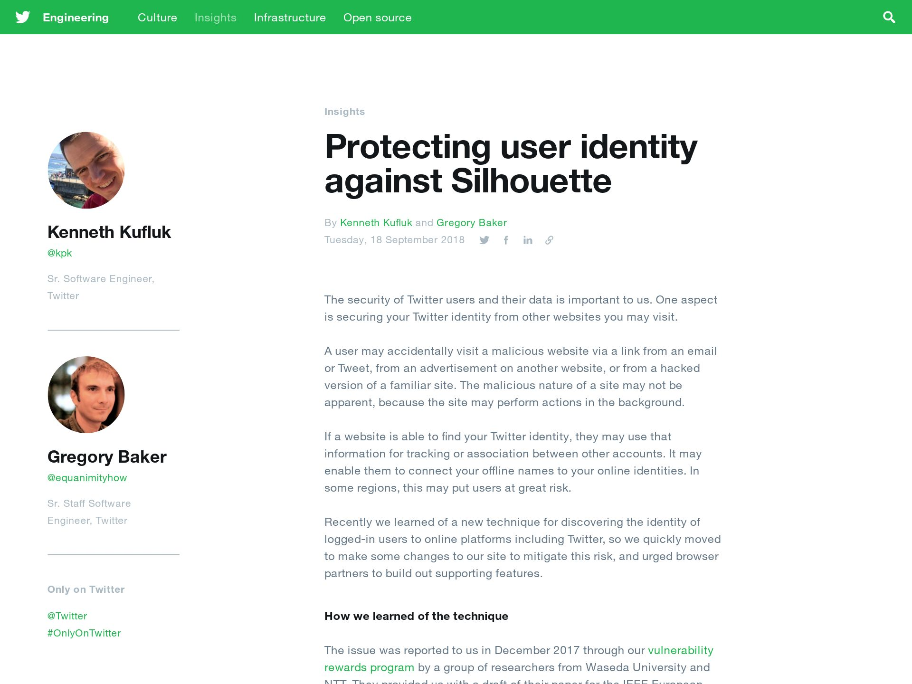

[slide=question]
Qui peut lire quels cookies ?

[slide=text]
`document.cookie` : l'API navigateur la plus étrange du monde

// [slide=blank, data-viewport=1]
// Démo document.cookie
//
// Démo document.cookie

[slide=question]
C'est quoi  une attaque XSS ?

[slide=blank, data-viewport=1]
Démo XSS

Démo XSS

image::img/screenshots/owasp-xss.jpg[url="https://www.owasp.org/index.php/Cross-site_Scripting_(XSS)"]

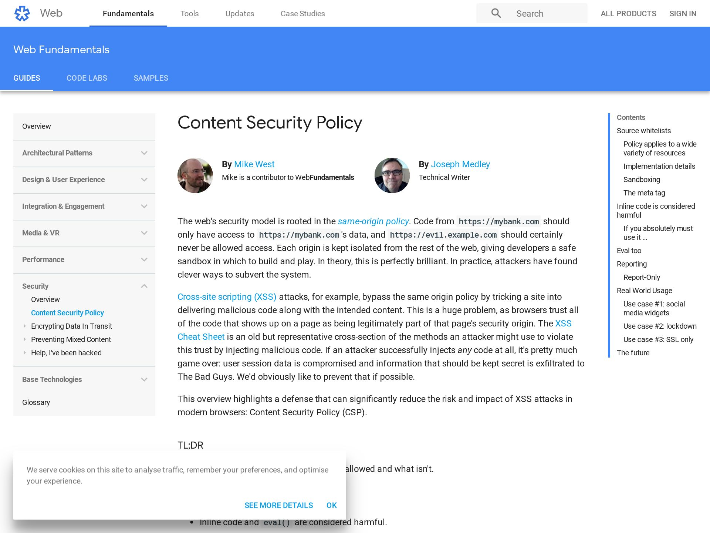

.Attribut `HttpOnly`
[source, cookies]
Set-Cookie: id=42; HttpOnly

// [slide=blank, data-viewport=1]
// Démo http only
//
// Démo http only

.Récap. des attributs
[source, cookies]
Set-Cookie: id=42;
            Expires=Tue, 03 Nov 2020 00:00:00 GMT;
            Max-Age=86400;
            Domain=one.cookies.rocks;
            Path=/api;
            Secure;
            HttpOnly;
            SameSite=Lax

image::img/screenshots/tough-cookies-article-scotthelme.jpg[url="https://scotthelme.co.uk/tough-cookies/"]

.Tough cookie example
[source, cookies]
Set-Cookie: __Host-id=42;
            Expires=Tue, 03 Nov 2020 00:00:00 GMT;
            Path=/;
            Secure;
            HttpOnly;
            SameSite

[.three]#prefix#
[.one]#attributs#

[slide=question]
Quelles alternatives  pour un stockage local ?

// [slide=text]
// `window.name` : la vieille technique cross-site
//
// [slide=blank, data-viewport=1]
// Démo window.name
//
// Démo window.name

[slide=text]
Web Storage : `localStorage` et `sessionStorage`

// [slide=blank]
// Démo Web Storage

// [slide=question]
// Que dit la CNIL ?
//
// image::img/screenshots/cnil-cookies-conformite.jpg[url="https://www.cnil.fr/fr/cookies-comment-mettre-mon-site-web-en-conformite"]
//
// image::img/screenshots/cnil-cookies-la-loi.jpg[url="https://www.cnil.fr/fr/cookies-traceurs-que-dit-la-loi"]

[contenteditable=true, data-viewport=5]
== Point de vue : celui/celle qui veut  "tracer" ses visiteurs

Editer le texte : celui/celle qui veut améliorer l'UX ses visiteurs

// rappel conditions du CSRF

[slide=blank, data-viewport=1]
Démo tracking cookie tiers avec referer

Démo tracking cookie tiers avec referer

[slide=question]
C'est quoi le referer ?

image::img/screenshots/caniuse-referer.jpg[url="https://caniuse.com/#search=referer"]

image::img/screenshots/w3c-referrer-policy.jpg[url="https://www.w3.org/TR/referrer-policy/"]

// [slide=question]
// C'est quoi un supercookie ?
//
// [slide=text]
// Traçage sans JavaScript : ETag, Date, HSTS Pinning, 301 Redirect...
// // redirect ?
//
// [slide=blank, data-viewport=1]
// Démo tracking etag avec referer
//
// Démo tracking etag avec referer
//
// [slide=text]
// Traçage avec JavaScript : Cache, Web Storage, IndexedDB,  window.name, Canvas...
//
// [slide=text]
// Traçage avec JavaScript : (CSS :visited)...
//
// [slide=text]
// Traçage JavaScript : (Flash, Silverlight)...
//
// image::img/screenshots/evrcookie.jpg[url="https://github.com/samyk/evercookie"]
//
// image::img/screenshots/evrcookie-browser-storage-mechanisms.jpg[url="https://github.com/samyk/evercookie#browser-storage-mechanisms"]

// == Point de vue : celui/celle  qui est soucieux  de sa vie privée
//
// [slide=question]
// Comment régler  mon navigateur ?
//
// [slide=text]
// Bloquer les cookies tiers
//
// // [slide=blank]
// // Démo du réglage des cookies tiers
//
// [slide=text]
// Bloquer l'en-tête `referer`
//
// // [slide=blank]
// // Démo du réglage des referers
//
// // [slide=question]
// // Ils sont où les cookies ?
//
// // [slide=blank]
// // Démo du fichier contenant les cookies
//
// [slide=question]
// Faut-il installer des  extensions navigateur  en plus ?
//
// image::img/screenshots/https-everywhere.jpg[url="https://www.eff.org/fr/https-everywhere"]
//
// //uBlock
//
// image::img/screenshots/adblockplus.jpg[url="https://adblockplus.org/fr/"]
//
// image::img/screenshots/ghostery.jpg[url="https://www.ghostery.com/fr/"]
//
// image::img/screenshots/addons-mozilla-firefox-container.jpg[url="https://addons.mozilla.org/en-US/firefox/addon/facebook-container/"]
//
// image::img/screenshots/disconnect-me.jpg[url="https://disconnect.me/"]
//
// image::img/screenshots/privacybadger.jpg[url="https://www.eff.org/fr/privacybadger"]
//
// image::img/screenshots/noscript.jpg[url="https://noscript.net/"]
//
// image::img/screenshots/panopticlick.jpg[url="https://panopticlick.eff.org/about"]
//
// image::img/screenshots/torbrowser.jpg[url="https://www.torproject.org/projects/torbrowser.html.en"]

// [slide=question]
// Que fait la navigation privée  dans tout ça ?

// [slide=question]
// WiFi gratuits ?

// [slide=question]
// La CNIL est mon amie

image::img/1994-2018.svg[]

Ça fait 24 ans qu'on se plain des cookies mais après toute cette enquête,
je me pose la question "est-ce que le Web en serait pas là aujourd'hui si on avait pas eu de

[slide=text]
[.blink]`<blink>` : la meilleure balise de tous les temps !

bannières publicitaires à base de texte clignotant et

video::videos/no.mp4[]

de gif animés".

[slide=blank]
outro

Les utilisateurs, les navigateurs et les annonceurs jouent au chat et à la souris,
Côté utilisateurs, certains bloquent les cookies et ajoute des

image::img/screenshots/adblockplus.jpg[url="https://adblockplus.org/fr/"]

bloqueurs de pub ou des

image::img/screenshots/ghostery.jpg[url="https://www.ghostery.com/fr/"]

bloqueurs de tracker.

[slide=blank]
outro

Pendant que Firefox et particulièrement Safari essaye par défaut de protéger leurs utilisateurs.
C'est une course sans fin qui ne résoud malheureusement pas le problème à long terme.

// Lou
// The answer is pretty simple:
//
// [#quote]
// The evil you know is better than the one you don't.
// This is probably a race we can't win.

[slide=blank]
Histoire d'outro avec Sherlock

[quote, Sherlock]
Wow!!!  Lots of facts!

Wow, ça fait beaucoup de facts !

[quote, Watson]
Indeed.

En effet.

[quote, Sherlock]
But now...

Oui mais maintenant John,

[quote, Sherlock]
We *can* identify when it smells!

Avec tout ces facts John,
Nous avons toutes les bases pour comprendre les cookies et se prémunir des attaques.
On *PEUT* savoir savoir quand est-ce que ça pue (dans nos projets) !

[quote, Sherlock]
We *should* spread  the knowledge!

Avec tout ces facts John,
On *DEVRAIT* pouvoir partager ce savoir à nos amis et notre famille,
leur expliquer ce qu'il se passe dans leur navigateur.

[quote, Sherlock]
We *must* debate about  the future of the Web!

Avec tout ces facts John,
On *DOIT* absoluement élever le débat et discuter ensemble du futur du Web.
Entre avoir plein de contenus gratuits, ne pas payer, refuser d'être tracé et refuser d'avoir des publicités, il va falloir choisir et trouver ensemble les nouveaux modèles économiques du Web vers lesquels nous voulons que notre société évolue...

.Merci bcp !
[slide=poster]
Outro

Je vous remercie bcp.

[slide=question]
Des questions ?
