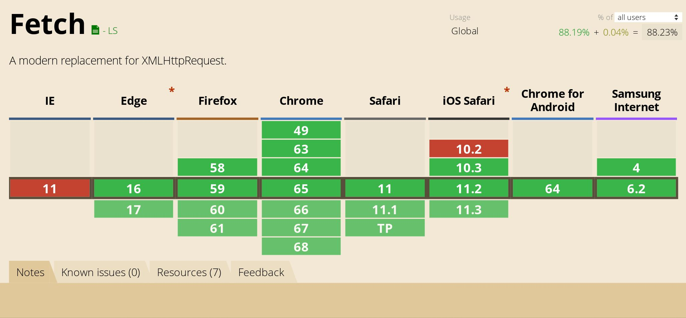
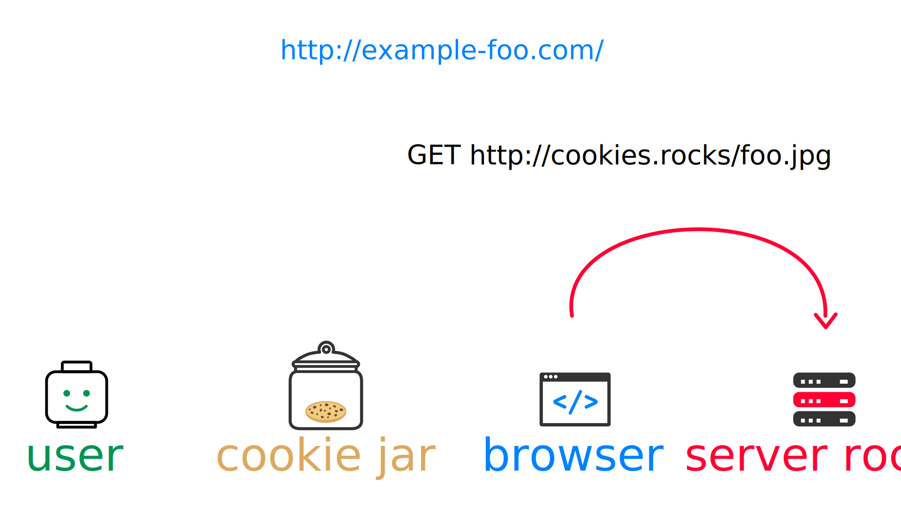

= #BackToBasics : HTTP Cookies
Hubert Sablonnière
:author-twitter: @hsablonniere
:author-avatar: img/hsablonniere-profil-2017.jpg
:author-company: Clever Cloud
:author-company-logo: img/clever-cloud-logo.svg
:hashtags: #CookiesRocks
:event: VoxxedBristol
:date: October 25th 2018

[slide=poster]
Intro

[slide=poster-bristol]
Intro

[.time]#00:00:00#

[WARNING]
This presentation does NOT cover any trending topic.
It focuses on a boring old thing invented in the 90s (which you may already know).
[.question]#Do you accept this talk?#
If you want to know more about how to deploy serverless Kotlin microservices in the blockchain with Kubernetes, you still have time to leave...

[.four]#musique#

[slide=location]
A few months ago...
221b Baker Street
London

[quote, Watson]
I'm almost there...

#British accent (grosse voix)#
I'm coming, almost there...

[quote, Watson]
What's up Sherlock?

What's your problem this time?

[quote, Watson]
What are we doing in bloody Bristol?

What are we doing in this wonderful conference?

[quote, Sherlock]
I'm disappointed by bloody developers!

#Accent anglais (voix condescendante)#
Well, you see Watson,
I'm really connfused by developers,
I looked at a few conference schedules...

[quote, Sherlock]
Such fashion victims!

...and it seems like they're only interested by latest trending tools and frameworks.

[quote, Watson]
It seems logical, isn't it?

I don't see the problems,
It seems logical to want to know more about the latest news about your own job.

[quote, Sherlock]
But they're missing  the great investigation!

Yes but, nobody's interested in old stuffs anymore.
Everyone's missing the greatest investigation of all time.

[quote, Watson]
Which one?

Hum?
Which one?

[quote, Sherlock]
HTTP cookies of course!

HTTP cookies of course!

[quote, Sherlock]
You know nothing John.

You know nothing John,
Everybody's using them but nobody really knows about their history, their origin and how they work.
It pushes developers to make lots of silly mistakes on Web projects,
and I also realize that muggles, _"non IT people", have a profound lack of knowledge regarding tracking and privacy.

[quote, Sherlock]
I asked Hubert to investigate...

I asked Hubert Sablonnière to investigate on this.

[quote, Watson]
The sodding froggy?

#Air déçu et inquiet#
Français ?

[quote, Sherlock]
Yes but he's a redhead.

yes but...
#hésitations#
you know, he looks a bit like us, doesn't he?

[quote, Sherlock]
#BackToBasics

I asked him to do a Back to Basics kind of talk...

[quote, Sherlock]
Facts, facts, facts!

...and to really insist on the _facts_, nothing but the _facts_.
That way, anyone - depending on the context, personal or profesional - will be able to detect some of the problems and take the right decisions...

[quote, Watson]
Interesting...

Hum, I'm intrigued...

[slide=poster]
Bonjour à tous

[.time]#00:02:00#
#mode normal (et énergique)#
Hello everyone!
I'm Hubert Sablonnière,
I'm a Web developer at #Clever Cloud#.

.Clever Cloud

[.question]#Who knows Clever Cloud?#
At Clever, we do **IT automation**.
We provide tooling on our cloud or _on-premises_ to let the developers focus on what they do best :
*writing code and pushing it*.
Meanwhile, we're focusing on the rest:
*Building, deploying, monitoring, automatically restarting the app when it crashes*
*and of course we maintain the different layers on which the code runs.*

// [source, js, slide=code]
// if (false === connaitCleverCloud) {
//   toi.passerAuStand('Clever Cloud');
// }
//
// Si vous ne nous connaissez pas, passez voir notre stand, on vous expliquera tout ça...
//
// [source, js, slide=code]
// if (true === connaitCleverCloud) {
//   toi.passerAuStand('Clever Cloud');
// }
//
// Si vous nous connaissez déjà, passez voir notre stand, on pourra discuter de la plateforme et de ce que vous en faite.
// Si vous... #PAUSE# Enfin bref...
//
// [source, js, slide=code]
// if (true) {
//   toi.passerAuStand('Clever Cloud');
// }
//
// ...passez voir notre stand ;-)

[slide=blank]
Enchaînement vers cookies

[.time]#00:03:00#
Today, I want to talk about my investigation on HTTP Cookies.

So I started to go back to the source of cookies.

image::img/2018-1994.svg[]

#Narrateur#
(The year is nineteen ninety-four)
and I got interested in...

// http://facesofopensource.com/lou-montulli/
// http://www.peteradamsphoto.com/lou-montulli-2/
image::img/loumontulli.jpg[author="Peter Adams", role="big top"]

...this man!
#Mains en l'air qui prient au ciel#

image::img/loumontulli.jpg[title="Lou Montulli" author="Peter Adams", role="big top"]

*Lou Montulli*
When you start to look at the history of the World Wide Web,
you'll find articles and stories about Tim Berners-Lee or Robert Cailleau.

[slide=text]
#ILoveLou : use this hashtag again and again...

Today, I'd like to honor Lou and emphasize on the impact he had on many Web technologies we're still using nowadays.
So, here we go for the anecdotes!

.Netscape
image::img/netscape_4-6.svg[role=logo]

Back in 1994, Lou was working at Netscape and with his colleagues...

[slide=text]
fishcam : fish aquarium, live since 1994

...he helped to setup the 2nd Webcam in history.
A small _easter-egg_ available via *Ctrl+Alt+F* on Netscape and which is still...

[slide=blank, data-viewport=3]
Démo fishcam

...available today on *fishcam.com* !
#Démo fishcam#
The aquarium is in California and here we can see a photo taken a few seconds ago.
#Child voice#
Hello littles fishies!
OK, so it downloads 30K every 2 seconds so 40megs before the end of the talk so I'm gonna close the tab.
-> 640 by 480 pixel image and took nearly 20 seconds
-> Updated every minute

[slide=text]
Lynx : text-based Web browser

Lou is also the co-creator of Lynx, a text-based Web browser.

// image::img/screenshots/wikipedia-lynx.jpg[url="https://en.wikipedia.org/wiki/Lynx_(web_browser)"]

[slide=blank, data-viewport=4]
Démo lynx

#Démo lynx#
For those who don't know about Lynx, it looks pretty simple but it's suuuuuper-fast!
I can browse the DevoxxUK CFP website,
I can search for "cookies" and find information about this presentation.
I have to admit, I don't use it everyday but each time I realize how much content and accessibility is important on a Website.

[slide=blank]
Intro <blink>

Oh, about Lynx.
During a summer evening in 1994, after work, Lou and his colleagues went to a bar to have some drinks.
They talked about the future of the Web and all the possible extensions of HTML and Lou was sad.
He mentioned that because Lynx a text-based only, he probably won't be able to support all these new features.
The only "dynamic" thing that Lynx could do is maybe make some text blink.

[slide=blank]
Intro <blink>

#Fake laugh#
Ah ah ah, they really had a good laugh about the fact that this idea was completely absurd.
The evening goes one, Lou will meet his future wife and the next morning, when he arrived at work,
He realized that his colleague, _"1st degree humor John_" went back to the office after the party...

[slide=text]
[.blink]`<blink>` : best HTML tag ever!

...and implemented during the night the best HTML tag ever!
So everything started as a non-documented  _easter-egg_ in Netscape.
You already know the end of this story.
And... I mean...

[slide=text]
[.shake]`<shake>` : if they asked me...

...if they asked my opinion, it could have been worse!

[slide=blank]
Lancement gif

We're making fun of this but we all used this tag,
and back then, everything was a good reason to catch the attention of visitors and show them banner ads.
When the Java plugin arrived in Netscape,
lots of people used it to animated text and make it scroll.
The problem was, that the plugin took around 30s to load.

video::videos/no.mp4[]

And that was frustrating our friend Lou.
He really wanted to find a replacement, a solution to do those banner ads without loading Java.
So after imploring for a month to his colleague Scott Furman, in charge of imaging code at Netscape,
he finally convinced him to...

[slide=text]
animated gifs : because Java applets take way too long to load

add an extension to the gif format and loop many times on the set of frames already in the file.
That's exactly why today, if you open any animated gif file with the right editor,
You'll see the "Netscape Application Block" which is here to define how much time you need to repeat the animation.
Zero for endless loop of course.

image::img/loumontulli.jpg[author="Peter Adams", role="light unzoom"]

[.one]#unzoom#
If I talk so much about Lou, it's also and mainly
because he's the inventor of HTTP cookies.
Backend the Web was pretty much statless,
so when you wanted to create an e-commerce site with a virtual cart while still being able to recognize a user between multiple page load...
#sad face# I mean, you had to get up early!
This is the exact reason why Lou wanted to add some state on the client side:
maintaining a user logged in to the site.
During my investigation, I tried to look at this case from many point of views,
and that's what I want to present today.
The main point of vue we will cover together...

[.zoom-patent]
image::img/screenshots/cookie-patent.jpg[url="https://patents.google.com/patent/US5774670A/en"]

// == TODO Point de vue : celui/celle qui utilise  des cookies  sur son site Web
== Point of view : those who use cookies  on their website

[.time]#00:08:00#
...is the point of view of those who use cookies on their website.
[.question]#Are their any developers in the room?#
OK, great.
So let's go back to basics,
we're going to ask several questions and try to give answers.
I'm probably going to explain stuffs you already know,
but recaps are always good anyway, right?
we'll also cover some very recent news aroud cookies.

[slide=question]
What is an HTTP cookie?

[.time]#00:08:30#
So first question : _What is an HTTP cookie?_
First we need to stop with the *cookies for dummies* definition : "cookies are tiny files stored on my computer".
It's imcomplete and dated because cookies are more that just a storage mechanism and it's been a while since we stopped storing one cookie per file.
We also need to stop mixing-up cookies and user sessions that are stored on the server side.
Too many times, I heard someone saying "yes, I stored the information in the cookies".
and when I looked for the info, they were stored on the server side, in the user session, in RAM.
I say no to those!
I prefer to describe cookies as a protocol.
A behaviour browsers and servers agreed to follow to maintain some state on the client side.
A small diagram.

image::img/cookies-flow-01.svg[]

A user wants to visit the site "cookies.rocks".

image::img/cookies-flow-02.svg[]

He or she types the address in the browser.

image::img/cookies-flow-03.svg[]

The browser makes a GET HTTP request to *http://cookies.rocks/*

image::img/cookies-flow-04.svg[]

The server responds with:
*200 OK* with the HTML page of the requested site.

image::img/cookies-flow-04b.svg[]

But more importantly, the server use the `Set-Cookie` header to ask the browser to store some information,
a key and a value.

image::img/cookies-flow-04c.svg[]

And... yes... most of the time this key/value pair will be used to store a unique ID linked to a server side user session.

image::img/cookies-flow-04d.svg[]

But it could also simply be the language chosen by the user or a custom theme...

image::img/cookies-flow-05.svg[]

On the browser side, we have a storage space, the cookie jar.
When the browser receives a cookie,

image::img/cookies-flow-06.svg[]

It stores it into the jar.

image::img/cookies-flow-07.svg[]

That way, a little bit later,

image::img/cookies-flow-08.svg[]

when the user goes back to the same site,

image::img/cookies-flow-09.svg[]

the browser looks into its jar to see if it has cookies for this site.

image::img/cookies-flow-10.svg[]

When it's the case,

the browser makes an HTTP request just like before:
*GET* to *http://cookies.rocks/*

image::img/cookies-flow-11b.svg[]

and it also sends the stored information in a `Cookie` header.

image::img/cookies-flow-11c.svg[]

Here we're still with our example with a session ID.
With this information,

image::img/cookies-flow-12.svg[]

The server can send its HTTP response:
*200 OK* with the requested HTML page.
But now...

image::img/cookies-flow-12b.svg[]

The response can be contextualized.

[slide=blank]
Les cookies, c'est ça.

Cookies are nothing more than this.
#PAUSE#
A protocol between servers and browsers allowing the storage of a state on the client side.

// [slide=blank, data-viewport=1]
// Démo d'un cookie simple dans le browser
//
// Démo d'un cookie simple dans le browser

image::img/rfcs-01.svg[]

This behaviour was invented by Lou Montulli in 1994.

image::img/rfcs-02.svg[]

We had a true RFC spec in 1997,

and another in 2000,
but in general,
#PAUSE#
and for the past 24 years,
#PAUSE#
it follows the same rules and behaviour.
#PAUSE#
So once a browser receives a cookie,

[slide=question]
How long a cookie is stored?

[.time]#00:11:40#
_How much time does he store it?_

.Expires at the end of the session
[source, cookies]
Set-Cookie: id=42

Without any options, when a server uses *Set-Cookie*,
it choses how much time the cookie must be stored.
Here the ID 42 will be stored until the end of the browser session.
Which means when the user closes the browser.
#PAUSE#
If the server wants to define a persitent cookie, it has to ways to do so:

.Expires at a specific date
[source, cookies]
Set-Cookie: id=42;
            Expires=Wed, 20 Jan 2021 10:30:00 GMT

He can use an [.two]#expiration date# with the [.one]#Expires# attribute.

.Expires after a specific duration
[source, cookies]
Set-Cookie: id=42; Max-Age=86400

Or he can define a specific [.two]#duration in seconds# with the [.one]#Max-Age# attribute.
-> Attribut ajouté par la première RFC officielle de 1997.
-> This attribute was added in the first official RFC in 1997 and is not supported on odl versions of IE..
#PAUSE#
Once a cookie is stored in the jar...

// [slide=blank]
// Démo de cookie persistent

[slide=question]
How can a server request  a cookie deletion?

[.time]#00:12:20#
..._how can a server request a cookies deletion_ before its expiration?
So at first I was like "there must be a `Delete-Cookie` header or a `Remove-Cookie` header..."
Yeaaaaah, nooooo....
NO!
For a server to ask for a cookie to be deleted...

.Ask for a cookie deletion
[source, cookies]
Set-Cookie: id=42;
            Expires=Thu, 01 Jan 1970 00:00:00 GMT

It needs to use the [.one]#Expires# attribute with a [.two]#date in the past#.
In general, people use the reference epoch date of january 1st 1970.

.Ask for a cookie deletion
[source, cookies]
Set-Cookie: id=42; Max-Age=0

The server can also ask for a deletion with the [.one]#Max-Age# attribute and a [.two]#duration of zero seconds#.

[slide=blank]
Pause, pb des cookies

So for now, things are simple, no surprises, no traps.
But since the beginning of the talk, I've been saying:
_"when the user goes back to the same site, the browser automatically sends the cookies that goes with it"_.
#PAUSE#
But what does it mean when I say "same site"?

[source, url]
http://my.site.net:8080/my-page.html
https://your-blog.com/the-article.php

How does a browser know that between address A and address B it's the same site or a different site?
In this example, it's simple but it's not always the case.
Here we touch the very aspect that cause lots of problems with HTTP cookies,

// [slide=blank]
// Démo suppression de cookie

[slide=question]
When does the browser  automatically send the cookies?

[.time]#00:13:30#
knowing when the browser will automatically send the cookies (or not).

[source, url, suffix="TLD"]
http://blue.cookies.rocks:80/page.html

// [source, url, suffix="TLD"]
// http://big.blue.cookies.rocks:80/awesome-page.html

If we look closely at a given URL,
we have 4 parts:
[.one]#the protocol#
[.three]#the host#
[.two]#the port#
[.four]#the path#
[.three]#&# [.four]#sub-domain#
[.three]#&# [.two]#domain#
// [.three]#&# [.one]#suffixe#

// [source, url]
// http://cookies.rocks/awesome-page.html
// http://blue.cookies.rocks/boring-page.html
//
// [source, url]
// https://blue.cookies.rocks/the-page.html
//
// [source, url]
// http://cookies.co.uk/the-page.html

.Attribute: `Domain=`
[source, cookies]
Set-Cookie: no-domain=no
Set-Cookie: root-domain=root; Domain=cookies.rocks
Set-Cookie: blue-subdomain=blue; Domain=blue.cookies.rocks
Set-Cookie: green-subdomain=green; Domain=green.cookies.rocks

[slide=blank, data-viewport=1]
Démos de cookies avec l'attribut Domain

Empty the cookies
Afficher "show cookies" sur cookies.rocks
Afficher "show cookies" sur blue.cookies.rocks
Afficher "show cookies" sur green.cookies.rocks
Lancer "la page attr Domaine" sur cookies.rocks

[slide=text]
`Domain=` : increases the range of the cookie  to all hosts ending with the value

Déposer des cookies pour des niveaux d'hôte plus généraux

.http://blue.cookies.rocks/
[source, url, setCookie="id=42"]
V http://blue.cookies.rocks/page.html
! http://big.blue.cookies.rocks/page.html
! http://green.cookies.rocks/page.html
! http://cookies.rocks/page.html
! http://foobar.rocks/page.html

.http://blue.cookies.rocks/
[source, url, setCookie="id=42; Domain=blue.cookies.rocks"]
V http://blue.cookies.rocks/page.html
V http://big.blue.cookies.rocks/page.html
! http://green.cookies.rocks/page.html
! http://cookies.rocks/page.html
! http://foobar.rocks/page.html

.http://blue.cookies.rocks/
[source, url, setCookie="id=42; Domain=cookies.rocks"]
V http://big.blue.cookies.rocks/page.html
V http://blue.cookies.rocks/page.html
V http://green.cookies.rocks/page.html
V http://cookies.rocks/page.html
! http://foobar.rocks/page.html

// .Quelles requêtes partiront avec les cookies ?
// [source, url, suffix="TLD"]
// http://cookies.rocks:80/page.html
// http://cookies.rocks:80/page.html
// http://blue.cookies.rocks:80/page.html
// http://example-foo.com:80/page.html
//
// .Réponse :
// [source, url, suffix="TLD"]
// http://cookies.rocks:80/page.html
// http://cookies.rocks:80/page.html
// # http://blue.cookies.rocks:80/page.html
// # http://example-foo.com:80/page.html
//
// .Déposé par http://cookies.rocks/page.html
// [source, cookies]
// Set-Cookie: id=42; Domain=cookies.rocks
//
// .Quelles requêtes partiront avec les cookies ?
// [source, url, suffix="TLD"]
// http://cookies.rocks:80/page.html
// http://cookies.rocks:80/page.html
// http://blue.cookies.rocks:80/page.html
// http://example-foo.com:80/page.html
//
// .Réponse :
// [source, url, suffix="TLD"]
// http://cookies.rocks:80/page.html
// http://cookies.rocks:80/page.html
// http://blue.cookies.rocks:80/page.html
// # http://example-foo.com:80/page.html
//
// [source, cookies]
// Set-Cookie: id=42; Domain=blue.cookies.rocks
//
// [source, cookies]
// Set-Cookie: id=42; Domain=big.blue.cookies.rocks

[slide=question]
A cookie with `Domain=rocks` ?

video::videos/no.mp4#t=4[]

[source, url, suffix="TLD"]
http://big.blue.cookies.rocks:80/page.html

[source, url, suffix="TLD"]
http://big.blue.cookies.co.uk:80/page.html

image::img/screenshots/mozilla-issue-252342.jpg[url="https://bugzilla.mozilla.org/show_bug.cgi?id=252342"]

image::img/screenshots/mozilla-issue-331510.jpg[url="https://bugzilla.mozilla.org/show_bug.cgi?id=331510"]

image::img/screenshots/mozilla-issue-342314.jpg[url="https://bugzilla.mozilla.org/show_bug.cgi?id=342314"]

image::img/screenshots/mozilla-public-suffix-list.jpg[url="https://wiki.mozilla.org/Public_Suffix_List"]

image::img/screenshots/publicsuffix-org.jpg[url="https://publicsuffix.org"]

image::img/rfcs-04.svg[]

image::img/screenshots/rfc6265-page23.jpg[url="https://tools.ietf.org/html/rfc6265#page-23", width="1024"]

image::img/screenshots/mozilla-source-effective-tld-names.jpg[url="https://dxr.mozilla.org/mozilla-central/source/netwerk/dns/effective_tld_names.dat", width="1024"]

image::img/screenshots/chrome-source-effective-tld-names.jpg[url="https://chromium.googlesource.com/chromium/src/net/+/master/base/registry_controlled_domains/effective_tld_names.dat"]

image::img/screenshots/safari-source-effective-tld-names.jpg[url="https://github.com/WebKit/webkit/blob/master/Source/WebCore/platform/soup/PublicSuffixSoup.cpp"]

.Public Suffix List (extracts)
[source, c, slide=code]
----
// uk : https://en.wikipedia.org/wiki/.uk
// Submitted by registry [Michael.Daly@nominet.org.uk]
uk
co.uk
gov.uk
me.uk
police.uk

// jp : https://en.wikipedia.org/wiki/.jp
// http://jprs.co.jp/en/jpdomain.html
// Submitted by registry [info@jprs.jp]
jp
okinawa.jp
osaka.jp
tokyo.jp
----

.Public Suffix List (extract)
[source, c, slide=code]
----
// GitHub, Inc.
// Submitted by Patrick Toomey [security@github.com]
github.io
githubusercontent.com

// Amazon Elastic Compute Cloud : https://aws.amazon.com/ec2/
// Submitted by Luke Wells [psl-maintainers@amazon.com]
*.compute.amazonaws.com

// Microsoft Corporation : http://microsoft.com
// Submitted by Justin Luk [juluk@microsoft.com]
azurecontainer.io
azurewebsites.net
azure-mobile.net
cloudapp.net
----

.Public Suffix List (extract)
[source, c, slide=code]
----
// Clever Cloud : https://www.clever-cloud.com/
// Submitted by Quentin Adam [noc@clever-cloud.com]
cleverapps.io
----

[source, url]
http://cookies.rocks/
http://www.bbc.co.uk/news/
http://www.metro.tokyo.jp/
https://hsablonniere.gitlab.io/babbler/
https://foobar.cleverapps.io/

[slide=question]
A cookie with `Domain=localhost` ?

video::videos/no.mp4#t=7[]

.Attribute: `Path=`
[source, cookies]
Set-Cookie: id=42; Path=/api
Set-Cookie: id=42; Path=/admin

.http://cookies.rocks/
[source, url, setCookie="id=42"]
V http://cookies.rocks/some-page.html
V http://cookies.rocks/api/profile
V http://cookies.rocks/api-faq

.http://cookies.rocks/
[source, url, setCookie="id=42; Path=/api"]
! http://cookies.rocks/some-page.html
V http://cookies.rocks/api/profile
! http://cookies.rocks/api-faq

.http://cookies.rocks/
[source, url, setCookie="id=42; Path=/api-"]
! http://cookies.rocks/some-page.html
! http://cookies.rocks/api/profile
! http://cookies.rocks/api-faq

.http://cookies.rocks/
[source, url, setCookie="id=42; Path=/api-"]
! http://cookies.rocks/some-page.html
! http://cookies.rocks/api/profile
! http://cookies.rocks/api-faq
V http://cookies.rocks/api-/foobar

[slide=text]
`Path=` : restricts the range of a cookie  to paths that start with the value*

// [slide=blank]
// Démos de cookies avec l'attribut path

.https://cookies.rocks/
[source, url, setCookie="id=42"]
V http://cookies.rocks/some-page.html
V https://cookies.rocks/some-page.html

Secure attribute

.Attribute: `Secure`
[source, cookies]
Set-Cookie: id=42; Secure

.https://cookies.rocks/
[source, url, setCookie="id=42; Secure"]
! http://cookies.rocks/some-page.html
V https://cookies.rocks/some-page.html

[slide=text]
`Secure` : restricts the range of a cookie  to secured requests

.HSTS header (warning!)
[source, http, slide=code]
Strict-Transport-Security: max-age=86400;
                           includeSubDomains

image::img/screenshots/owasp-hsts.jpg[url="https://www.owasp.org/index.php/HTTP_Strict_Transport_Security_Cheat_Sheet"]

.http://cookies.rocks/ (not secured)
[source, url, setCookie="id=42; Secure"]
! http://cookies.rocks/some-page.html
V https://cookies.rocks/some-page.html

image::img/screenshots/draft-ietf-httpbis-cookie-alone.jpg[url="https://tools.ietf.org/html/draft-ietf-httpbis-cookie-alone-01", width="1024"]

.Received by the server
[source, http, slide=code]
Cookie: id=42

image::img/rfcs-05.svg[]

.Cookie prefix: `__Secure`
[source, cookies]
Set-Cookie: __Secure-id=42; Secure

.Cookie prefix: `__Host`
[source, cookies]
Set-Cookie: __Host-id=42; Secure; Path=/

[source, url]
http://blue.cookies.rocks:80/page.html

[slide=question]
Is there a check on the port?

video::videos/no.mp4#t=13[]

[slide=text]
SOP : Same Origin Policy

[source, url]
http://blue.cookies.rocks:80/page.html

image::img/screenshots/draft-west-origin-cookies.jpg[url="https://tools.ietf.org/html/draft-west-origin-cookies-01", width="1024"]

[slide=text]
AJAX : Asynchronous JavaScript & XML

.XHR on the same origin
[source, js, slide=code]
----
const xhr = new XMLHttpRequest();
xhr.open('GET', '/url', true);
xhr.responseType = 'json';

xhr.send();
----

.XHR on a different origin
[source, js, slide=code]
----
const xhr = new XMLHttpRequest();
xhr.open('GET', '/url', true);
xhr.responseType = 'json';

xhr.withCredentials = true;

xhr.send();
----

.CORS headers to save the day
[source, http, slide=code]
Access-Control-Allow-Credentials: true

[slide=text]
fetch : "Better AJAX"

[source, js, slide=code]
fetch('/url', { credentials: 'same-origin' })
fetch('/url', { credentials: 'omit' })
fetch('/url', { credentials: 'include' })

image::img/cookies-csrf-01.svg[]

Start CSRF explanation

image::img/cookies-csrf-03.svg[]

image::img/cookies-csrf-04.svg[]

image::img/cookies-csrf-06.svg[]

image::img/cookies-csrf-07.svg[]

image::img/cookies-csrf-08.svg[]

image::img/cookies-csrf-09.svg[]

[slide=question]
What is a  CSRF/XSRF attack?

[slide=blank, data-viewport=1]
Démos CSRF

#Démo CSRF#
Set profile sur cookies.rocks
Aller sur example-foo et cliquer sur naked pictures

image::img/screenshots/owasp-csrf.jpg[url="https://www.owasp.org/index.php/Cross-Site_Request_Forgery_(CSRF)"]

image::img/rfcs-05.svg[]

.Attribute: `SameSite=`
[source, cookies]
Set-Cookie: id=42; SameSite=Lax
Set-Cookie: id=42; SameSite=Strict

// [slide=blank]
// Démos samesite

[#screenshot-caniuse-samesite-cookies.contain]

// TODO article twitter

[slide=question]
Who can read cookies?

[slide=text]
`document.cookie` : craziest Web API ever

[slide=blank, data-viewport=1]
Démo document.cookie

Démo document.cookie

[slide=question]
What is an XSS attack?

[slide=blank, data-viewport=1]
Démo XSS

Démo XSS

image::img/screenshots/owasp-xss.jpg[url="https://www.owasp.org/index.php/Cross-site_Scripting_(XSS)"]

image::img/screenshots/developers-google-csp.jpg[url="https://developers.google.com/web/fundamentals/security/csp/"]

.Attribute: `HttpOnly`
[source, cookies]
Set-Cookie: id=42; HttpOnly

[slide=blank, data-viewport=1]
Démo http only

Démo http only

.Cookie attributes recap
[source, cookies]
Set-Cookie: id=42;
            Expires=Tue, 03 Nov 2020 00:00:00 GMT;
            Max-Age=86400;
            Domain=one.cookies.rocks;
            Path=/api;
            Secure;
            HttpOnly;
            SameSite=Lax

.Tough cookie example
[source, cookies]
Set-Cookie: __Host-id=42;
            Expires=Tue, 03 Nov 2020 00:00:00 GMT;
            Path=/;
            Secure;
            HttpOnly;
            SameSite

[slide=question]
What alternatives  to store data locally?

[slide=text]
`window.name` : good old cross-site technique

[slide=blank, data-viewport=1]
Démo window.name

Démo window.name

[slide=text]
Web Storage : `localStorage` and `sessionStorage`

// [slide=blank]
// Démo Web Storage

//[slide=question]
//Que dit la CNIL ?
//
//image::img/screenshots/cnil-cookies-conformite.jpg[url="https://www.cnil.fr/fr/cookies-comment-mettre-mon-site-web-en-conformite"]
//
//image::img/screenshots/cnil-cookies-la-loi.jpg[url="https://www.cnil.fr/fr/cookies-traceurs-que-dit-la-loi"]

[contenteditable=true, data-viewport=5]
== Point of view : those who want to  track their visitors

Editer le texte : celui/celle qui veut améliorer l'UX ses visiteurs

// rappel conditions du CSRF

[slide=blank, data-viewport=1]
Démo tracking cookie tiers avec referer

Démo tracking cookie tiers avec referer

[slide=question]
What is the `referer`?

image::img/screenshots/w3c-referrer-policy.jpg[url="https://www.w3.org/TR/referrer-policy/"]

[slide=question]
What is a supercookie?

[slide=text]
Tracking without JavaScript : ETag, Date, HSTS Pinning, 301 Redirect...
// redirect ?

[slide=blank, data-viewport=1]
Démo tracking etag avec referer

Démo tracking etag avec referer

[slide=text]
Tracking with JavaScript : Cache, Web Storage, IndexedDB,  window.name, Canvas...

[slide=text]
Tracking without JavaScript : (CSS :visited)...

[slide=text]
Tracking with JavaScript : (Flash, Silverlight)...

image::img/screenshots/evrcookie-browser-storage-mechanisms.jpg[url="https://github.com/samyk/evercookie#browser-storage-mechanisms"]

== Point of view : those concerned by  online privacy

[slide=question]
How do I configure my browser?

[slide=text]
Block third-party cookies

// [slide=blank]
// Démo du réglage des cookies tiers

[slide=text]
Block `referer` header

// [slide=blank]
// Démo du réglage des referers

// [slide=question]
// Ils sont où les cookies ?

// [slide=blank]
// Démo du fichier contenant les cookies

[slide=question]
Should I also install  browser extensions?

image::img/screenshots/https-everywhere.jpg[url="https://www.eff.org/en/https-everywhere"]

//uBlock

image::img/screenshots/adblockplus.jpg[url="https://adblockplus.org/"]

image::img/screenshots/ghostery.jpg[url="https://www.ghostery.com/"]

image::img/screenshots/addons-mozilla-firefox-container.jpg[url="https://addons.mozilla.org/en-US/firefox/addon/facebook-container/"]

image::img/screenshots/disconnect-me.jpg[url="https://disconnect.me/"]

image::img/screenshots/privacybadger.jpg[url="https://www.eff.org/privacybadger"]

image::img/screenshots/torbrowser.jpg[url="https://www.torproject.org/projects/torbrowser.html.en"]

// [slide=question]
// Que fait la navigation privée  dans tout ça ?

// [slide=question]
// WiFi gratuits ?

// [slide=question]
// La CNIL est mon amie

We've all been complaining about cookies, their limitations and their misuse for the past 24 years but,
after all this investigation,
I have to ask the question "would we have the open and standard World Wide Web we use today without banner ads using blinkink text and animated gifs"
I mean, it also spread because lots of sites relied on advertisement to make a revenue and because users had access to lots of contents for free.
Nowadays, advertisers and browser makers have been playing a cat and mouse game.
and in those cases, it's an endless race.

// Lou
// The answer is pretty simple:
//
// [#quote]
// The evil you know is better than the one you don't.
// This is probably a race we can't win.

[slide=blank]
Histoire d'outro avec Sherlock

[quote, Sherlock]
Wow!!!  Lots of facts!

Wow, I was not expecting that many facts!

[quote, Watson]
Indeed.

Indeed.

[quote, Sherlock]
But now...

Yes but now John,

[quote, Sherlock]
We *can* identify when it smells!

With all those facts,
We have all the basics to understand cookies and where to look for to prevent attacks.
We *can* identify when it stinks in our Web projects!

[quote, Sherlock]
We *should* spread  the knowledge!

With all those facts,
We *should* be able to spread the knowledge to our muggle friends and family,
we should explain them what happens in their browsers.

[quote, Sherlock]
We *must* debate about  the future of the Web!

With all those facts,
We absolutely *must* rise the debate and discussion together about the futur of the Web and it's model.
Between having everything for free, not paying and blocking every ads and trackers, we'll have to chose and push together new economic models towards which we want our society to evolve.

.Thanks!
[slide=poster]
Outro

[slide=question]
Questions?
