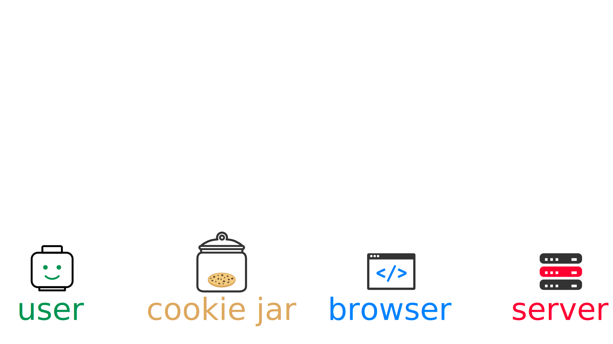
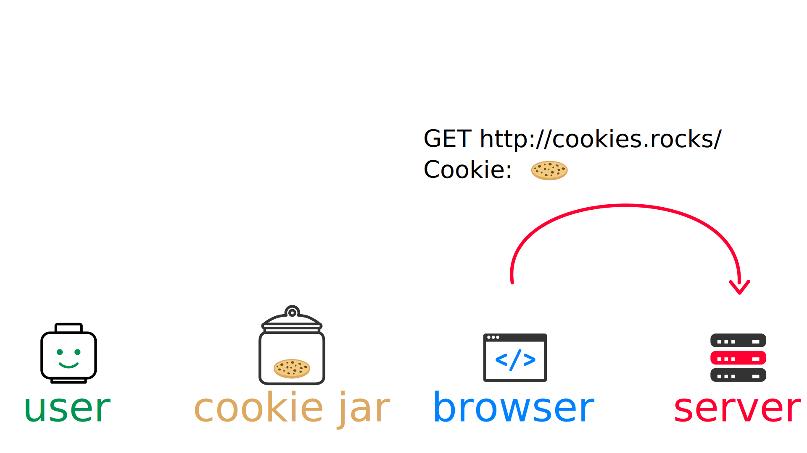
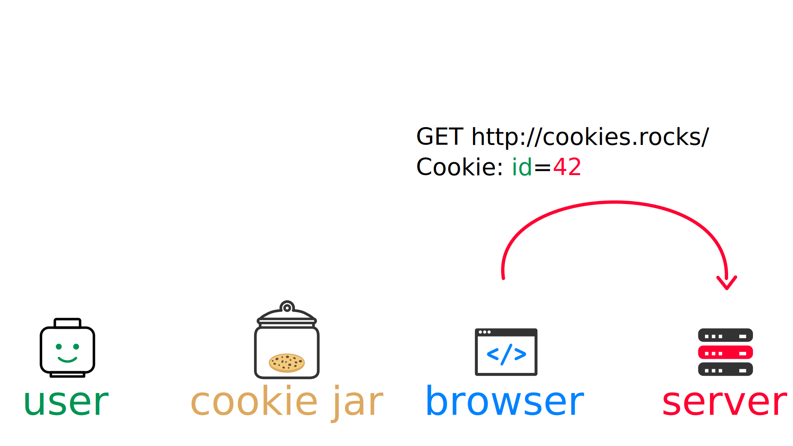
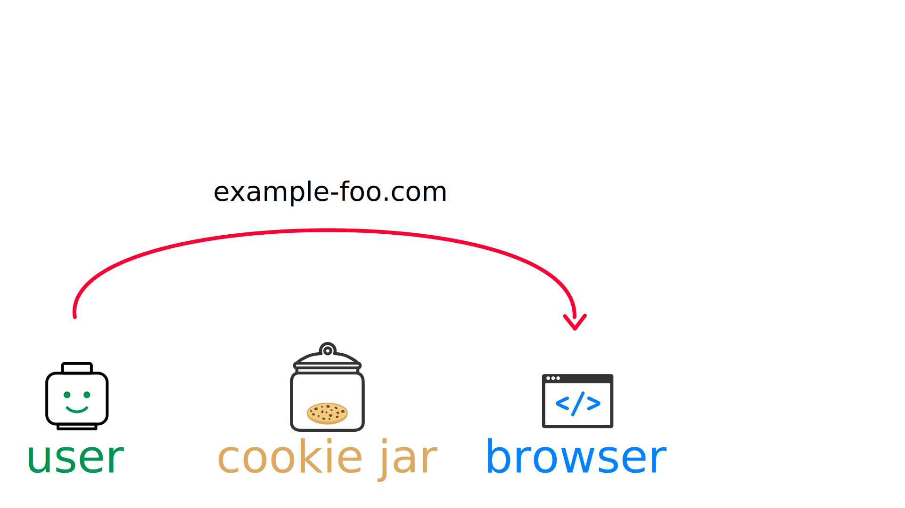

= #RetourAuxSources : Les Cookies HTTP
Hubert Sablonnière
:author-twitter: @hsablonniere
:author-avatar: img/hsablonniere-profil-2017.jpg
:author-company: Clever Cloud
:author-company-logo: img/clever-cloud-logo.svg
:hashtags: #CookiesRocks
:event: Mutualab
:date: 29 mai 2018

[slide=poster]
Bonjour à tous

[.time]#00:02:00#
#mode normal (et énergique)#
Bonjour à *toutes* et tous !
J'm'appelle Hubert Sablonnière,
J'suis développeur Web chez #Clever Cloud#.

.Clever Cloud
image::img/cc-rocket-man.png[role=logo]

[.question]#Qui connait Clever Cloud ?#
Chez Clever, on fait de l'**IT automation**.
// Quand je dis IT automation, ça veut dire que globalement on fournit un outil et que ce soit sur notre cloud ou "on-premise", les développeurs n'ont plus qu'à envoyer leur code et nous on s'occupe du reste :
On fournit un outil sur notre cloud _ou "on-premise"_ qui permet aux devs de se concentrer sur l'essentiel :
*écrire du code et le pousser*.
Pendant ce temps là, nous on se concentre sur le reste :
*Le builder, le déployer, le "monitorer", relancer automatiquement ce qui est planté*
*et bien évidemment maintenir et mettre jour toutes les couches sur lesquelles ce code tourne.*

// [source, js, slide=code]
// if (false === connaitCleverCloud) {
//   toi.passerAuStand('Clever Cloud');
// }
//
// Si vous ne nous connaissez pas, passez voir notre stand, on vous expliquera tout ça...
//
// [source, js, slide=code]
// if (true === connaitCleverCloud) {
//   toi.passerAuStand('Clever Cloud');
// }
//
// Si vous nous connaissez déjà, passez voir notre stand, on pourra discuter de la plateforme et de ce que vous en faite.
// Si vous... #PAUSE# Enfin bref...
//
// [source, js, slide=code]
// if (true) {
//   toi.passerAuStand('Clever Cloud');
// }
//
// ...passez voir notre stand ;-)

[slide=blank]
Enchaînement vers cookies

[.time]#00:03:00#
Aujourd'hui, j'ai envie de vous parler de mon enquête sur les cookies HTTP.

image::img/2018-unknown.svg[]

Alors, j'ai commencé par retourner à la source des cookies.

#Narrateur#
(Nous sommes en 1994)
et je me suis intéressé à...

// http://facesofopensource.com/lou-montulli/
// http://www.peteradamsphoto.com/lou-montulli-2/
image::img/loumontulli.jpg[author="Peter Adams", role="big top"]

...ce monsieur!
#Mains en l'air qui prient au ciel#

image::img/loumontulli.jpg[title="Lou Montulli" author="Peter Adams", role="big top"]

*Lou Montulli*
Quand on s'intéresse à l'histoire du Web,
on parle souvent de Tim Berners-Lee ou de Robert Cailleau.

[slide=text]
#ILoveLou : mot-dièse à utiliser sans modération

Aujourd'hui, je voudrai rendre hommage à Lou et souligner l'impact qu'il a eu sur pas mal de technologies du Web qu'on utilise encore aujourd'hui.
C'est parti pour les anecdotes !

.Netscape
image::img/netscape_4-6.svg[role=logo]

En 1994, Lou travaille chez Netscape et avec ses collègues...

[slide=text]
fishcam : des poissons en live depuis 1994

...il met en place la 2ème webcam de l'histoire.
Un petit _easter-egg_ accessible via *Ctrl+Alt+F* sur Netscape et qui aujourd'hui...

[slide=blank, data-viewport=3]
Démo fishcam

...est toujours dispo sur *fishcam.com* !
#Démo fishcam#
L'aquarium est en Californie et là on voit bien une photo qui date d'il y a qq secondes.
#Voix d'enfant#
Coucou les petits poissons !
Bon, ça DL 30 kilo toutes les 2 secondes soit 40 megs d'ici là fin du talk alors on va fermer la page quand même.
-> 640 by 480 pixel image and took nearly 20 seconds
-> Updated every minute

[slide=text]
Lynx : navigateur Web en mode texte

Lou est aussi le co-créateur de Lynx, un navigateur Web en mode texte

// image::img/screenshots/wikipedia-lynx.jpg[url="https://en.wikipedia.org/wiki/Lynx_(web_browser)"]

[slide=blank, data-viewport=4]
Démo lynx

#Démo lynx#
Pour ceux qui connaissent pas, Lynx, c'est assez rudimentaire mais c'est *uuuultra*-rapide !
Je peux aller sur le site du CFP de Devoxx,
chercher "cookies" et trouver des infos sur cette présentation.
Je m'en sers pas tous les jours, mais à chaque fois je trouve que ça remet en perspective l'importance du contenu et de l'accessibilité sur un site Web.

[slide=blank]
Intro <blink>

A propos de Lynx, tiens.
Une soirée d'été 1994, après le boulot, Lou et ses collègues vont boire des verres dans un bar.
Ils discutent du futur du Web, des possibles extensions d'HTML et dans cette discussion, Lou mentionne qu'il était un peu triste car à cause de ses limitations graphiques, Lynx ne pourraient probablement pas supporter toutes ces nouveautés.
La seule chose que Lynx pouvait faire, c'était à la rigueur de faire clignoter du texte.

[slide=blank]
Intro <blink>

#Faux rire#
Ah ah ah, qu'est ce qu'ils ont bien rigolé sur le fait que cette idée était complètement absurde.
La soirée continue, Lou rencontre celle qui deviendra sa femme et le lendemain matin en arrivant au boulot,
il découvre que son collègue _"Jean-Michel 1er degré"_ est repassé par le bureau après la soirée...

[slide=text]
[.blink]`<blink>` : la meilleure balise de tous les temps !

...et a implémenté dans la nuit la meilleure balise de tout les temps.
Tout a donc commencé avec un _easter-egg_ non documenté dans Netscape.
La suite de l'histoire, vous la connaissez...
Et encore...

[slide=text]
[.shake]`<shake>` : si on m'avait demandé mon avis...

...si j'avais participé à cette soirée, ça aurait pu être bien pire !

[slide=blank]
Lancement gif

On se moque mais, cette balise on l'a tous utilisé,
et à l'époque, tout était bon à prendre pour attirer l'attention des visiteurs sur les bannières de pub.
Quand le plugin Java est arrivé dans Netscape,
beaucoup s'en sont emparé pour animer du texte et le faire défiler.
Le problème, c'est que le plugin mettait une bonne trentaine de secondes à se lancer.

video::videos/no.mp4[]

Et ça, ça frustrait beaucoup notre ami Lou.
Il voulait remplacer les pubs en Java par autre chose.
Du coup pendant un mois, il a tanné Scott Furman, celui qui bossait sur le code d'imaging de Netscape,

[slide=text]
gifs animés : parceque Java c'est trop long à charger

pour ajouter une extension au format gif et ainsi boucler plusieurs fois sur l'animation des frames présentes dans le fichier.
C'est exactement pour ça qu'aujourd'hui encore, si vous ouvrez n'importe quel gif animé avec le bon éditeur,
vous verrez le "Netscape Application Block" qui permet de préciser combien de fois l'animation doit recommencer.
Avec 0 pour l'infini.

image::img/loumontulli.jpg[author="Peter Adams", role="light unzoom"]

[.one]#unzoom#
Si je vous parle autant de Lou c'est aussi est surtout,
parce que c'est l'inventeur des cookies HTTP.
À une époque où le Web était encore complètement sans état,
implémenter un site e-commerce avec un panier virtuel tout en étant capable de reconnaître un même client entre plusieurs chargement de pages...
#grimace# c'était pas la joie.
Et c'est bien dans ce but précis,
maintenir un visiteur connecté sur un site
que Lou a voulu ajouter un état côté client.
Dans mon enquête je me suis intéressé à plusieurs points de vues.
Celui que je veux vous présenter aujourd'hui,

[.zoom-patent]

== Point de vue : celui/celle qui utilise  des cookies  sur son site Web

[.time]#00:08:00#
c'est le point de vue de celui ou celle qui utilise des cookies sur son site Web.
[.question]#Il y des devs dans la salle ?#
Ça tombe bien !
Donc on va vraiment revenir aux bases,
en posant une série de questions et en y apportant des réponses.
Je vais peut-être expliquer des choses que vous savez déjà,
mais les rappels ça fait toujours du bien
et on va aussi parler de certaines nouveautés.

[slide=question]
C'est quoi un cookie HTTP ?

[.time]#00:08:30#
Première question : _C'est quoi un cookie HTTP ?_
Déjà on va arrêter de dire que les cookies sont des fichiers stockés sur un ordinateur.
C'est incomplet et daté car les cookies c'est + qu'une forme de stockage et ça fait bien longtemps qu'on ne stocke plus un cookie par fichier.
On va également arrêter de mélanger/confondre les cookies avec une session utilisateur stockée côté serveur.
Trop souvent, j'entends quelqu'un dire, "j'ai stocké cette info dans les cookies"
alors qu'en fait l'info est stockée en RAM, côté serveur, dans la session utilisateur.
Je dis NON !
Moi j'préfère présenter les cookies comme un protocole.
Un comportement sur lequel navigateurs et serveurs se sont mis d'accord pour maintenir un état côté client.
Petit schéma.

image::img/cookies-flow-01.svg[]

Un utilisateur veut se rendre sur le site "cookies.rocks".

image::img/cookies-flow-02.svg[]

Il tape l'adresse dans son navigateur.

image::img/cookies-flow-03.svg[]

Son navigateur fait une requête HTTP :
*GET* vers *http://cookies.rocks/*

Le serveur répond :
*200 OK* avec la page HTML du site demandé.

Mais surtout, le serveur utilise l'en-tête *`Set-Cookie`* pour demander au navigateur de stocker de l'information,
une clé et une valeur.

image::img/cookies-flow-04c.svg[]

Et c'est vrai... que... le plus souvent, ce couple clé/valeur, permet de stocker un identifiant unique.

Après ça peut aussi être tout simplement la langue choisie par l'utilisateur, un thème personnalisé...

image::img/cookies-flow-05.svg[]

Côté navigateur, on a un espace de stockage, la jarre à cookies.
Quand le navigateur reçoit un cookie.

image::img/cookies-flow-06.svg[]

Il le stocke dans sa jarre.

Du coup, un peu plus tard,

image::img/cookies-flow-08.svg[]

quand l'utilisateur retourne sur le même site,

image::img/cookies-flow-09.svg[]

le navigateur regarde dans sa jarre si des cookies ont été déposés pour ce site,

image::img/cookies-flow-10.svg[]

Et quand c'est le cas,

image::img/cookies-flow-11.svg[]

le navigateur fait sa requête HTTP comme avant :
*GET* vers *http://cookies.rocks/*

et il renvoie l'information stockée avec l'en-tête *Cookie*

Ici, on continue l'exemple où le cookie contient un identifiant.
Avec cette information,

image::img/cookies-flow-12.svg[]

Le serveur peut envoyer sa réponse HTTP :
*200 OK* avec la page HTML du site demandé.
Et surtout,

Il peut contextualiser sa réponse.

[slide=blank]
Les cookies, c'est ça.

Les cookies, c'est ça.
#PAUSE#
Un protocole entre le serveur et le navigateur permettant le stockage d'un état côté client.

// [slide=blank, data-viewport=1]
// Démo d'un cookie simple dans le browser
//
// Démo d'un cookie simple dans le browser

Ce fonctionnement a été inventé et spécifié par Lou Montulli en 1994.

image::img/rfcs-02.svg[]

On a eu une vraie RFC en 1997,

image::img/rfcs-03.svg[]

et une autre en 2000,
mais globalement,
#PAUSE#
depuis 24 ans,
#PAUSE#
ça fonctionne toujours de la même manière.
#PAUSE#
Une fois que le navigateur a reçu un cookie.

image::img/cookies-csrf-02.svg[]

image::img/cookies-csrf-04.svg[]

image::img/cookies-csrf-05.svg[]

image::img/cookies-csrf-06.svg[]

image::img/cookies-csrf-08.svg[]

[slide=question]
Que dit la CNIL ?

image::img/screenshots/cnil-cookies-la-loi.jpg[url="https://www.cnil.fr/fr/cookies-traceurs-que-dit-la-loi"]

[contenteditable=true, data-viewport=5]
== Point de vue : celui/celle qui veut  "tracer" ses visiteurs

Editer le texte : celui/celle qui veut améliorer l'UX ses visiteurs

// rappel conditions du CSRF

[slide=blank, data-viewport=1]
Démo tracking cookie tiers avec referer

Démo tracking cookie tiers avec referer

[slide=question]
C'est quoi le referer ?

[slide=question]
C'est quoi un supercookie ?

[slide=text]
Traçage sans JavaScript : ETag, Date, HSTS Pinning, 301 Redirect...
// redirect ?

[slide=blank, data-viewport=1]
Démo tracking etag avec referer

Démo tracking etag avec referer

[slide=text]
Traçage avec JavaScript : Cache, Web Storage, IndexedDB,  window.name, Canvas...

[slide=text]
Traçage avec JavaScript : (CSS :visited)...

[slide=text]
Traçage JavaScript : (Flash, Silverlight)...

image::img/screenshots/evrcookie.jpg[url="https://github.com/samyk/evercookie"]

image::img/screenshots/evrcookie-browser-storage-mechanisms.jpg[url="https://github.com/samyk/evercookie#browser-storage-mechanisms"]

== Point de vue : celui/celle  qui est soucieux  de sa vie privée

[slide=question]
Comment régler  mon navigateur ?

[slide=text]
Bloquer les cookies tiers

// [slide=blank]
// Démo du réglage des cookies tiers

[slide=text]
Bloquer l'en-tête `referer`

// [slide=blank]
// Démo du réglage des referers

// [slide=question]
// Ils sont où les cookies ?

// [slide=blank]
// Démo du fichier contenant les cookies

[slide=question]
Faut-il installer des  extensions navigateur  en plus ?

image::img/screenshots/https-everywhere.jpg[url="https://www.eff.org/fr/https-everywhere"]

//uBlock

image::img/screenshots/adblockplus.jpg[url="https://adblockplus.org/fr/"]

image::img/screenshots/ghostery.jpg[url="https://www.ghostery.com/fr/"]

image::img/screenshots/addons-mozilla-firefox-container.jpg[url="https://addons.mozilla.org/en-US/firefox/addon/facebook-container/"]

image::img/screenshots/noscript.jpg[url="https://noscript.net/"]

image::img/screenshots/panopticlick.jpg[url="https://panopticlick.eff.org/about"]

image::img/screenshots/torbrowser.jpg[url="https://www.torproject.org/projects/torbrowser.html.en"]

// [slide=question]
// Que fait la navigation privée  dans tout ça ?

// [slide=question]
// WiFi gratuits ?

// [slide=question]
// La CNIL est mon amie

image::img/1994-2018.svg[]

Ça fait 24 ans qu'on se plain des cookies mais après toute cette enquête,
je me pose la question "est-ce que le Web en serait pas là aujourd'hui si on avait pas eu de bannières publicitaires à base de texte clignotant et de gif animés".
Les navigateurs et les annonceurs jouent au chat et à la souris,
une course sans fin qui ne résoud pas le problème à long terme.

// Lou
// The answer is pretty simple:
//
// [#quote]
// The evil you know is better than the one you don't.
// This is probably a race we can't win.

[slide=blank]
Histoire d'outro avec Sherlock

.Merci bcp !
[slide=poster]
Outro

[slide=question]
Des questions ?
